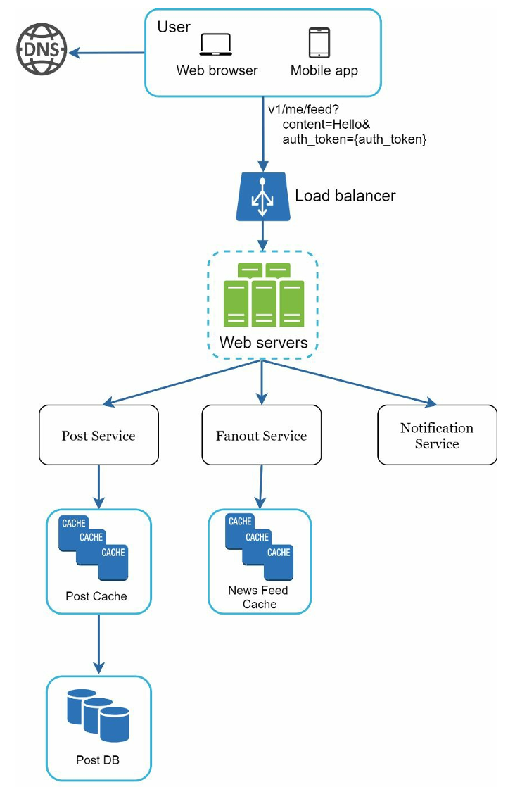
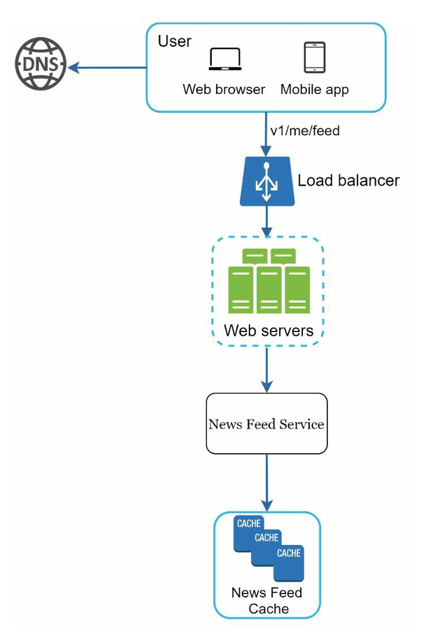
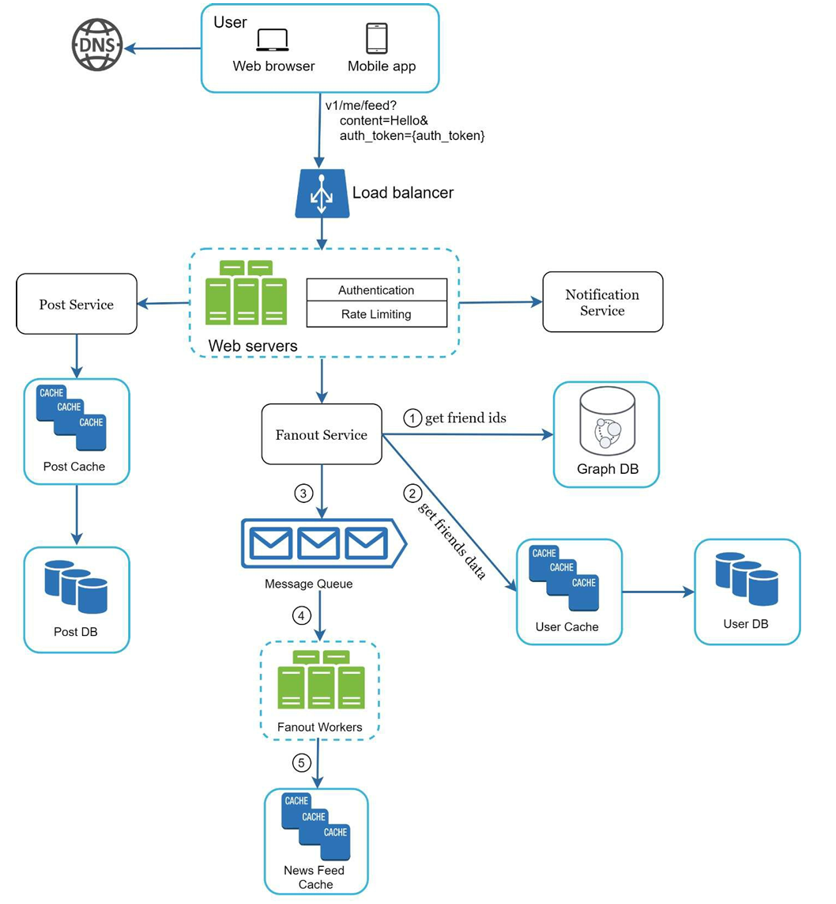
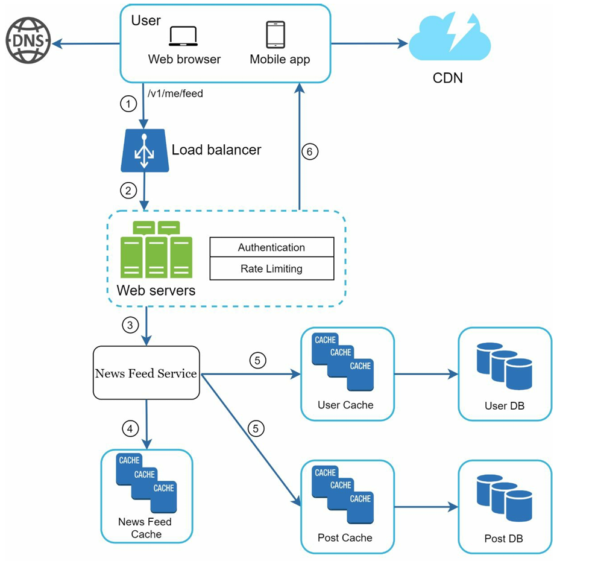
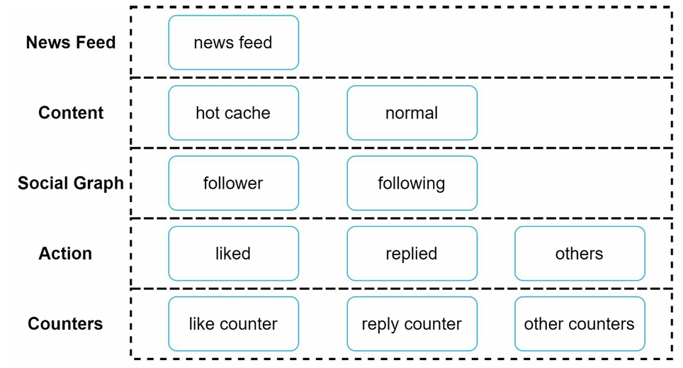

## Functional Requirements

1. news feed that shows **latest** posts/news uploaded on the platform
2. User can publish a post/news && can consume latest posts/news on the platform
3. sorted based on time

## Non-Functional Requirements

1. 10 million DAU

## 2. High-level design and getting a buy-in

#### We will have this system in 2 flows: **feed publishing and feed building**

1. **Feed publishing**: when a user publishes a post --> data is written into cache and database -- && ALSO && -- the same post is populated to their friends’ news feed.
2. **Newsfeed building**: for simplicity, let us assume the news feed is built by aggregating friends’ posts in reverse chronological order.

#### API Endpoints

1. Feed publishing API: To publish a post, a HTTP **POST request** will be sent to the server.
   - POST /v1/me/feed
   - Params:
     - content: content is the text of the post.
     - auth_token: it is used to authenticate API requests.
2. Newsfeed retrieval API: The API to retrieve news feed is a **HTTP GET request**as shown below:
   - GET /v1/me/feed
   - Params:
     - auth_token: it is used to authenticate API requests.

### 2.3 Feed Publishing

- User can view news feeds on a browser or mobile app. A user makes a post with content “Hello” through API: /v1/me/feed?content=Hello&auth_token={auth_token}
- Load balancer distributes traffic to web servers.
- Web servers redirect traffic to different internal services.
- **Post service** --> persists post in the database and cache.
- **Fanout service** --> pushes new content to friends’ news feed from cache **AS Newsfeed data is stored in the cache for fast retrieval**.
- **Notification service** --> informs friends that new content is available and sends out push notifications.

### 2.4 News Feed Building

- User: a user sends a request to retrieve her news feed. The request looks like this: / v1/me/feed.
- Load balancer: load balancer redirects traffic to web servers.z
- Web servers: web servers route requests to newsfeed service.
- **Newsfeed service fetches news feed from the cache.**
- Newsfeed cache: store news feed IDs needed to render the news feed.

# 3. Deep Dive

## 3.1 Fanout Service

### First Principole Analysis:

- Fan out means taking one event and distributing its consequences to many destinations.
- If one user creates one post, that **single action does not remain a single isolated piece of data**. In a social system, that one action has to affect **many other users**:
  - followers may need to see it
  - notifications may need to be triggered
  - caches may need to be updated
  - ranking pipelines may need to consider it
  - unread counters may need to change

##### So the system faces a basic expansion problem: **"One write from one producer must be propagated to many consumers."** --> That expansion is fan out.

### 3.1.1 Two Types (PUSH && PULL)

**Scenario:**
Think of a teacher posting an announcement in a class portal.

**There are two ways the system can behave:**

- **Option A: Distribute Immediately**

  - The moment the teacher posts, the system pushes that announcement into every student’s dashboard.
  - That is like **fan out on write**. --> "write" because it happens after user has posted news
  - This is also called a **PUSH model**.
- **Option B: Distribute Lazily(whenever students asks for it)**

  - The system stores the announcement centrally, and each student’s dashboard fetches relevant announcements **ONLY WHEN** that student opens the portal.
  - That is like **fan out on read**. --> "read" because it happens after any other user has asked for it
  - This is also called a PULL model.

So, “fan out” is not just one technique. **It is the general act of expanding content toward all relevant readers.**

---

- Pros & Cons:
  1. Fanout on write/push model:

     - [P1] The news feed is generated in real-time and can be pushed to friends immediately.
     - [P2] Fetching news feed is fast because the news feed is pre-computed during write time.
     - [C1] If a user has many friends, fetching the friend list and generating news feeds for all of them is slow and time consuming. This is called the hotkey problem.
     - [C2] For inactive users or those who rarely log in, pre-computing news feeds wastes computing resources.
  2. Fanout on read/Pull model:

     - [P1] For inactive users or those who rarely log in, fanout on read works better because it will not waste computing resources on them.
     - [P2] Data is not pushed to friends, so there is no hotkey problem.
     - [C1] Fetching the news feed is slow as the news feed is not pre-computed.

### 3.1.2 Our Choice & Reasoning (hybrid shit:)

#### • If celebrities post, then we would use fan out on read --> bcoz we cant add 40 million pairs in queue (as they have 40M followers and we will create a <post_id, recipient_id> pair for all of them)

#### • If normal people post, we will use fan out on write --> since we can add 500 pairs in queue.

## 3.2 Feed Publishing Flow

### Steps:

1. Fetch friend IDs from the graph database. Graph databases are suited for managing friend relationship and friend recommendations.
2. Get friends info from the user cache. The system then filters out friends based on user settings.
   - For example, if you mute someone, her posts will not show up on your news feed even though you are still friends.
   - Another reason why posts may not show is that a user could selectively share information with specific friends or hide it from other people.
3. Send friends list and new post ID to the message queue.
4. Fanout workers fetch data from the message queue and store news feed data in the news feed cache. You can think of the news feed cache as a <post_id, user_id> mapping table. --> Whenever a new post is made, it will be appended to the **news feed cache and news feed table**.
   - ONLY NECESSARY DATA STORED --> The memory consumption can become very large if we store the entire user and post objects in the cache. Thus, only IDs are stored.
   - TTL BECAUSE WE NEED LATEST POSTS IN FEED --> To keep the memory size small, we set a configurable limit. The chance of a user scrolling through thousands of posts in news feed is slim. Most users are only interested in the latest content, so the cache miss rate is low.
5. Store <post_id, user_id > in news feed cache.

##### Summary:

Suppose:
    - you are user `A`
    - your new post is `P100`
    - friends allowed to see it are `B`, `C`, and `D`
Then the fanout workers will write following entries in **news_feed_cache** entries like **<post_id_from_A, recipient_id>**:
    - `<P100, B>`
    - `<P100, C>`
    - `<P100, D>`

## 3.3 Feed Retrieval Flow

### Steps:

1. A user sends a request to retrieve her news feed. The request looks like this: /v1/me/feed
2. The load balancer redistributes requests to web servers.
3. Web servers call the news feed service to fetch news feeds.
4. News feed service gets a list post IDs from the news feed cache.
5. A user’s news feed is more than just a list of feed IDs. It contains username, profile picture, post content, post image, etc. Thus, the news feed service fetches the complete user and post objects from caches (user cache and post cache) to construct the fully hydrated news feed.
6. The fully hydrated news feed is returned in JSON format back to the client for rendering.

## 3.3 Extensive Use of Cache

Cache is extremely important for a news feed system. We divide the cache tier into 5 layers:
- **News Feed:** It stores IDs of news feeds.
- **Content:** It stores every post data. Popular content is stored in hot cache.
- **Social Graph:** It stores user relationship data.
- **Action:** It stores info about whether a user liked a post, replied a post, or took other actions on a post.
- **Counters:** It stores counters for like, reply, follower, following, etc.

# Extra Optimizations

1. Scaling the database:
    - Vertical scaling vs Horizontal scaling
    - SQL vs NoSQL
    - Master-slave replication
    - Read replicas
    - Consistency models
    - Database sharding
2. Keep web tier stateless
3. Cache data as much as you can
4. Support multiple data centers
5. Decouple components with message queues
6. Monitor key metrics, such as QPS during peak hours and latency while users refresh their news feed