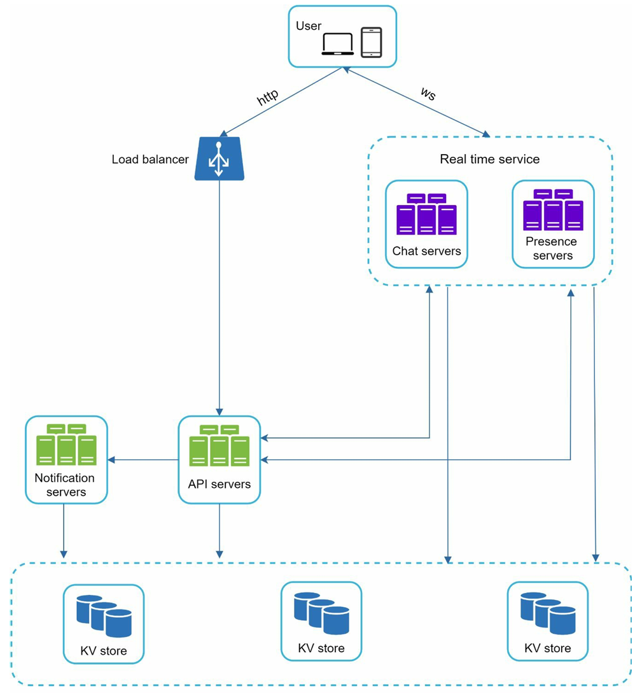
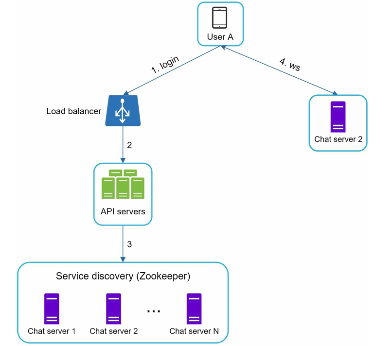
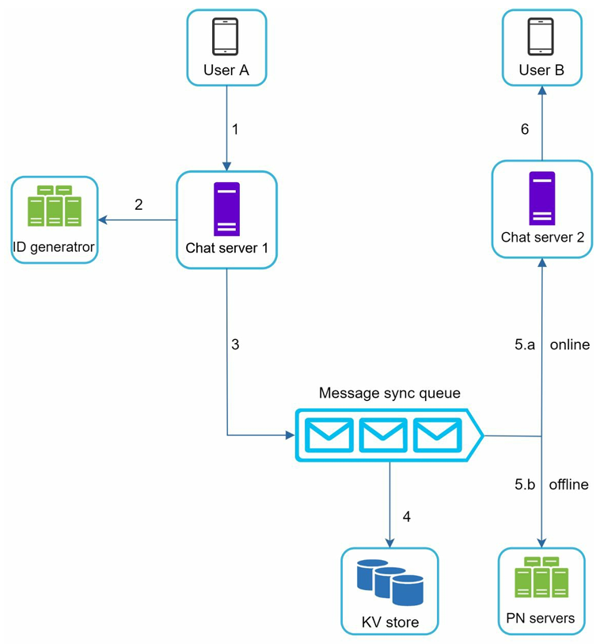
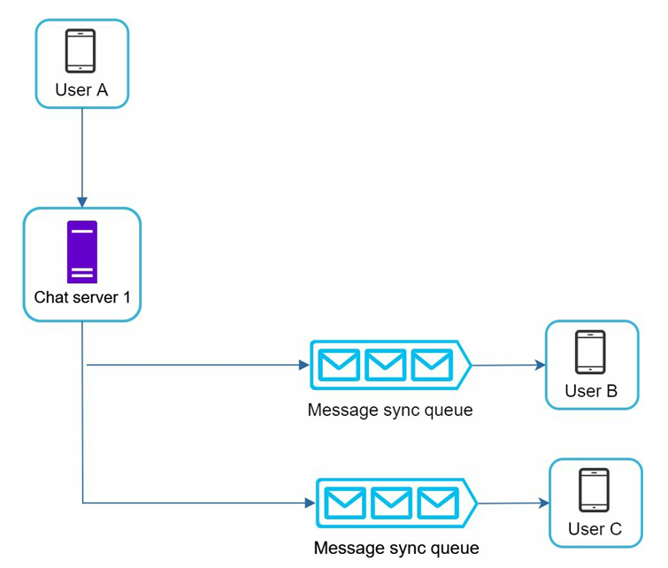
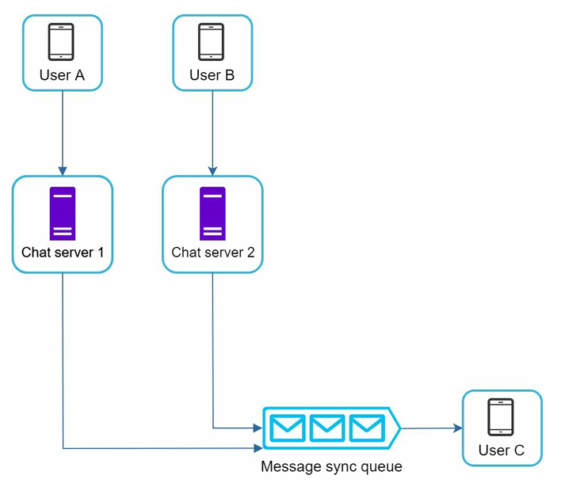
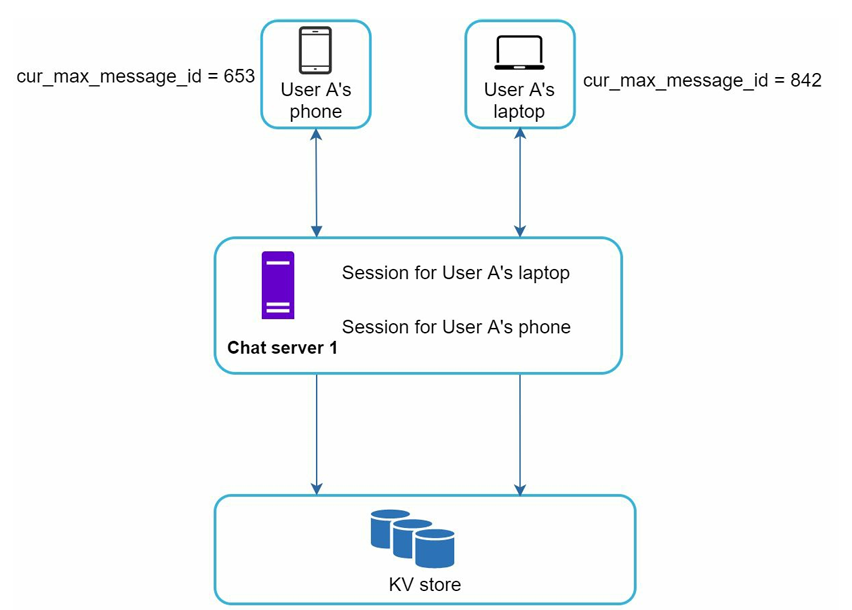
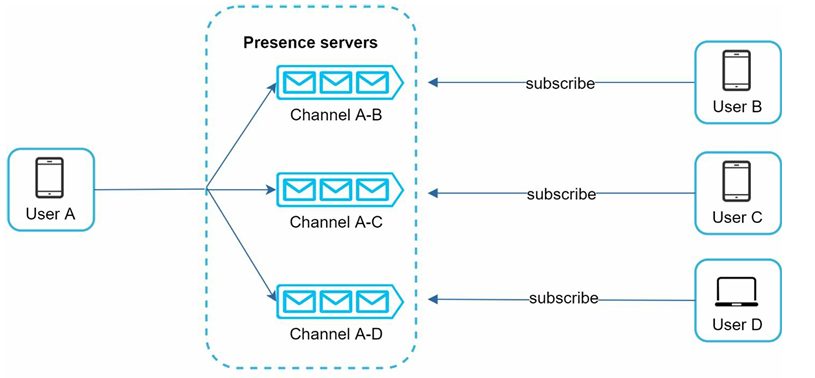

## Functional Requirements

- mobile app and web app
- 1 to 1 chat && group chat
- max group chat people = 100
- "online?" indicator
- only text messages
- encryption if possible
- Multiple device support. The same account can be logged in to multiple accounts at the
  same time.
- Push notifications

## Non-Functional Requirements

- 50 Million DAU
- max limit of message = 100,000
- **storing chat history FOREVER**

# High-level design and getting a buy-in

### Protocols:

#### 1. Time-tested HTTP protocol

1. HTTP keep-alive headers enable the client to maintain a persistent connection, minimizing the overhead of repeated TCP handshakes and improving efficiency.
2. Due to its reliability and widespread adoption, HTTP is commonly used on the sender side for message delivery in chat systems.

#### 2. Polling

- Polling is a technique in which the client periodically asks the server if there are messages available.
- Depending on polling frequency, polling could be costly.
- It could consume precious server resources to answer a question that offers no as an answer most of the time

#### 3. Long Polling

1. In long polling, a client holds the connection open until there are actually new messages available or a timeout threshold has been reached.
2. Once the client receives new messages, it immediately sends another request to the server, restarting the process.

Drawbacks:

- Sender and receiver may reach different servers due to stateless HTTP or load balancers, breaking message delivery.
- Server cannot detect if client is disconnections.
- Inefficient for low-activity users, as it repeatedly reconnects after timeouts even without messages.

#### 4. Websockets

- WebSocket connection is initiated by the client.
- It is bi-directional and persistent.
- **It starts its life as an HTTP connection and could be upgraded via some well-defined handshake to a WebSocket connection.**
- WebSocket connections generally work even if a firewall is in place.

  - This is because they use port 80 or 443, which are also used by HTTP/HTTPS connections.
- Use WebSocket on the sender as well as the receiver side because it is bi-directional and does not have the limitation that HTTP had.

### Basic Architecture

### High Level Design Modules

#### 1. STATELESS SERVICES

These are basic services that are required for the basic functioning in the chat service, apart from the chatting feature, such as:

- service discovery
- authentication service
- group management
- user profile management

#### 2. STATEFUL SERVICES

- The only stateful service is the chat service.
- The service is stateful because each client maintains a persistent connection to the chat server and does not switch as long as the server is still available.
- The Service Discovery Service coordinates with the chat service to avoid server overloading.

#### 3. THIRD PARTY INTEGRATION

- Push notification service: it is a third-party integration because it should work even when the application is not running.

#### 4. Storage Systems

2 types of data to be tackled:

1. Generic Data: user profile data, settings, friends list, etc.
2. Chat Data: chat history data

**It is important to understand the read/write pattern.**

- The amount of data is enormous for chat systems. For example: Facebook messenger and Whatsapp process 60 billion messages a day.
- Only recent chats are accessed frequently. **Users do not usually look up for old chats.**
- Although very recent chat history is viewed in most cases, users might use **features that require random access of data**, such as:
  - search
  - view your mentions
  - jump to specific messages, etc.
  - --> These cases should be supported by the data access layer.

##### HENCE --> The read to write ratio is about 1:1 for 1 on 1 chat apps. --> bcoz one write typically corresponds to one intended consumer

##### We could have chosen a hybrid system of RDBMS for generic data and KV Stores for chat data. BUT, we know that --> **relational databases do not handle the long tail of data well—when the indexes grow large, random access becomes expensive.**

##### Hence, to keep everything SCALABLE && VERY LOW LATENCY, we use

#### 5. Data models

##### Table 1: Message Table (1-on-1 chat)

| Field        | Type      | Description           |
| ------------ | --------- | --------------------- |
| message_id   | bigint    | Primary key           |
| message_from | bigint    | Sender user ID        |
| message_to   | bigint    | Receiver user ID      |
| content      | text      | Message text/content  |
| created_at   | timestamp | Message creation time |

- We will be using `message_id` as the primary key, because using `created_at `as the primary key is very difficult, as two messages can be created at the same time.

##### Table 2: Group Message Table

The group message table is designed for group chats. --> Here, `channel_id` and `group_id` are used interchangeably.

| Field      | Type      | Description              |
| ---------- | --------- | ------------------------ |
| channel_id | bigint    | Partition key (group ID) |
| message_id | bigint    | Sort key                 |
| user_id    | bigint    | Sender user ID           |
| content    | text      | Message text/content     |
| created_at | timestamp | Message creation time    |

**Composite primary key:** (channel_id, message_id) --> `channel_id` acts as the partition key since all queries in a group chat operate under a channel and then furthermore we use `message_id` as the sort key to index it further to find any message quickly.

##### How to generate Keys:

1. `channel_id`: this can be done using a simple id generator because this does not need to be in a sequence.
2. `message_id`: these IDs need to satisfy **two requirements** such that it is **unique && sortable by time**.

**IMPORTANT --> An auto increment feature could have been used, but NoSQL databases do not provide such a feature.**

Approach taken:

1. For key generation, we can use the 64-bit UUID generator like Snowflake from Chapter 7.
2. We can use that number generator as a **local sequence number generator**, which means that IDs are unique within a group and within a chat --> Maintaining message sequence within one-on-one channel or a group channel is sufficient, and message ids **dont need to be globally sequenced.**

# Deep Dive in Components

## 1. Service Discovery

##### The Main Purpose --> of service discovery in a chat system is: to recommend the most suitable chat server for a client based on various criteria, such as geographical location, server load/capacity, and availability. This ensures that each user is directed to an optimal server for minimizing latency and maximizing reliability.

- A common implementation approach is to use a service such as Apache Zookeeper for service discovery:
  - Zookeeper maintains a registry of all available chat servers and their status.
  - When a client needs to connect, the service discovery mechanism selects the best server using predefined rules (like proximity or least-loaded server) and sends this information to the client.

#### General Workflow

1. **User Login Attempt:** User A tries to log in to the system.
2. **Initial Authentication:** The load balancer receives the login request from User A and forwards it to the API servers.
3. **Service Discovery:** After authenticating the user, the API servers query the service discovery component (e.g., Zookeeper) to determine the best available chat server for User A. --> Service discovery picks a suitable chat server (e.g., Chat Server 2) and returns the server address to the client (based on current load, server health, or User A’s geographical location).
4. **WebSocket Connection:** User A establishes a connection to the assigned chat server via WebSocket for real-time communication.

### 1.1 Message Flows

#### 1.1.1 one-on-one chat flow

1. User A sends a chat message to Chat server 1.
2. Chat server 1 **requests and receives** a unique message ID from the ID generator.
3. Chat server 1 sends the message, along with the generated ID, to the message sync queue.
4. The message is saved in a **key-value store to ensure persistence**.
5. Message Delivery:
   a. **If User B is online, the message sync queue forwards the message to Chat server 2, where User B is connected.**
   b. Chat server 2 delivers the message to User B over their **persistent WebSocket connection**.
6. **If User B is offline, a push notification is sent to User B using push notification servers.**

#### 1.1.2 Group Chat Flow

1. When **User A** sends a message in a group chat (for example, in a group with three members: User A, User B, and User C), the message is first sent to Chat Server 1.
2. **Chat Server 1** receives this message and creates a separate copy of the message in each group member’s message sync queue (also known as their "inbox"). Specifically, one copy is placed in User B’s message sync queue, and another in User C’s message sync queue.
3. This design offers the following key advantages:
   1. **Simplified Message Retrieval**: Each client only needs to read its own inbox to obtain new group messages, which greatly simplifies synchronization for recipients.
   2. **Efficiency for Small Groups**: For a small number of recipients, creating per-recipient message copies is both inexpensive and practical.

#### 1.1.3 Receiver's End

1. On the receiving end, a user can receive messages from multiple senders WITHIN OR NOT WITHIN the group. All the messages will be in the receiver's message sync queue.
2. If a recipient is online, the chat server delivers messages from their sync queue in real time over the active WebSocket connection. If the recipient is offline, the message stays in their queue until they reconnect, and a push notification may be sent when necessary.

#### 1.1.4 Message synchronization across multiple devices

- When a user logs in on multiple devices (e.g., phone and laptop), each device establishes a separate WebSocket connection with the chat server.
- Each device maintains its own `cur_max_message_id` to keep track of the latest message seen by that device.
- Messages that satisfy the following two conditions are considered as news messages::
  1. The recipient ID == currently logged-in user.
  2. Incoming Message ID > `cur_max_message_id`.
- Devices independently synchronize with the chat server by fetching all messages with IDs greater than their current `cur_max_message_id`.

## 2. Online Presence/Status

**There are a few flows that will trigger online status change. Let us examine each of them.**

### 2.1 Basic Methods:

1. When a user logs in, their online status is set to "online" and their information is stored in the online users list.
2. When a user logs out, their status is updated to "offline" and they are removed from the online users list.
3. If a user's connection drops or they disconnect unexpectedly --> we wait for the online client's **PERIODIC HEARTBEAT** for some time called `timeout` --> if no heartbeat before timeout then set status to "offline".
   - Example: heartbeat sent by client every 5 seconds - server declares offline after a timeout of 30 seconds

### 2.2 Online Status Fanout

When there is a change in the online status --> this is PUBLISHED to n channels.

##### Each channel represents a 1-n channel on the presence server.

`Channel A-B` just helps in understanding but just like the messages had a queue for all the incoming messages from every sender --> it is most probable to have the same global queue for every sender which acts as a Presence signal queue.

##### Fanout is implemented as a PUBLISHER-SUBSCRIBER MODEL

- THIS per-user online status fanout design **ONLY WORKS WELL** for small groups (e.g., WeChat's 500-member cap).
- For large groups (e.g., 100,000 members), broadcasting status changes to all users creates significant overhead.
- To address scalability, online status can be fetched only when users **join the group**or **MANUALLY REFRESH** their friend list, reducing unnecessary updates and system load.

# Extras

- **Support for Media Files**

  - Extend the chat application to handle media such as photos and videos --> Media files are significantly larger than text.
    - ⚡ Compression techniques can reduce file sizes for faster upload/download.
    - ⚡ Generate and display thumbnails for efficient previewing of media.
- **End-to-End Encryption**
- **Client-Side Message Caching** --> Cache messages on the client device to decrease data transfer with the server.
- **Improve Load Time** using geographically distributed networks to cache data and improve load times.
- **Chat Server Failure and Recovery**: With potentially hundreds of thousands of persistent connections, single server failure is disruptive.

  - If a chat server becomes unavailable --> **Service discovery (such as Zookeeper)**can allocate new chat servers for clients to reconnect.
- **Message Resend Mechanism** --> Retry and queueing are common techniques for resending messages.

# REMARKS

[1]. A relay is an intermediate system that receives a message, determines where it should go, and forwards it to the right destination. --> So is not necessarily the final storage or final UI endpoint; it is the system that takes the sender’s message and moves it to the intended recipient path. --> **Hence the process is called RELAYING and not sending.**

[2]. Zookeeper Working:
    1. A cluster of ZooKeeper servers forms an ensemble.
    2. Clients connect to the ensemble.
    3. Data is stored in a hierarchical namespace of znodes.
    4. Clients can read/write znodes.
    5. Clients can **set watches** on znodes.
    6. When something changes, ZooKeeper notifies interested clients.
    7. The ensemble relies on a quorum/majority to stay consistent and available.
