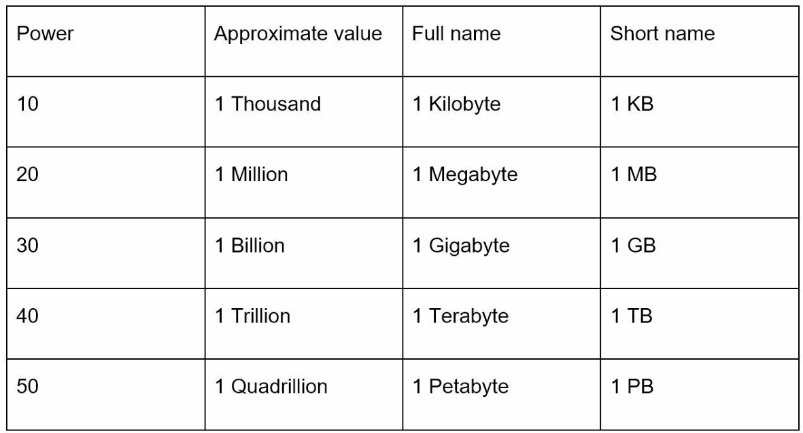
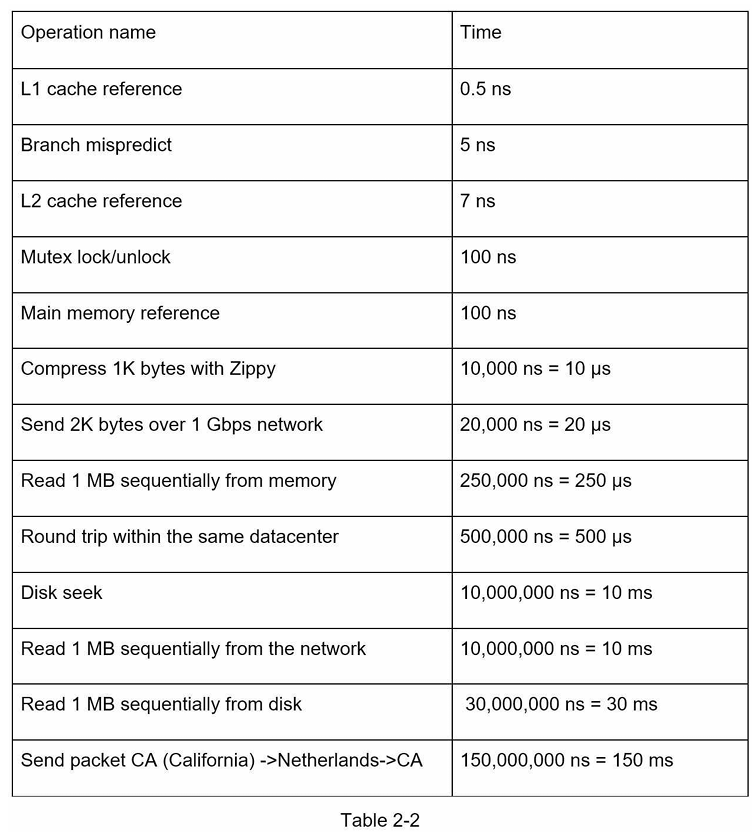
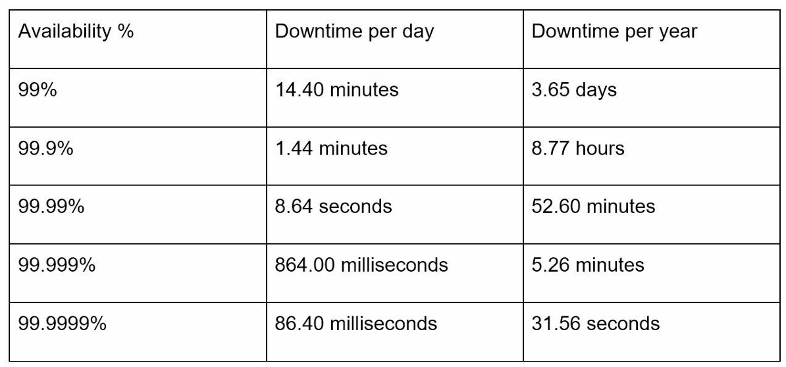
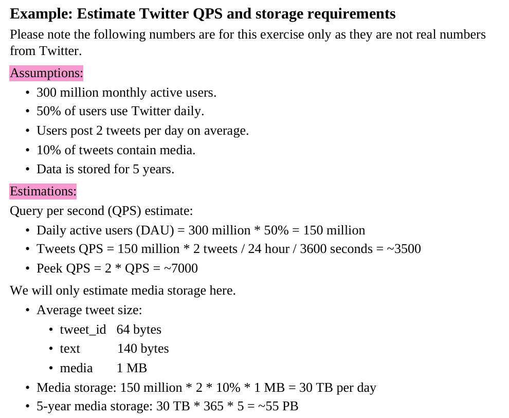

# Basics Taught

## 1. Power of two rules



## 2. Popular numbers



## 3. Availability numbers



# Estimation Example:



### MAU & DAU (Monthly / Daily Active Users)

1. Based on the data given, we would generally need to find out DAU because that's how we tend to find QBS.

### QPS (Queries Per Second)

1. It tells us how many queries are hit by the users in total to a system.
2. This is also in terms of seconds because we need to understand the frequency and the estimation of traffic.

### Peak QPS

1. This is because query per second is an average estimation, but we need to build systems such that it works for the WORST CASE.
2. A hand-wavy gesture of estimating a worst case is basically twice the queries per second. And that's why we have:

$$
Peak QPS = 2 * QPS
$$

3. In interviews, we can tell based on the conditions I assume that the peak QPS is 5-10 times the QPS, and it will still be fine. So it can basically be:
$$ Peak QPS = x * QPS $$
> --> where x can be any scalar based on assumption

### IMPORTANT --> Why is QPS measured per second, but storage is measured per day/year?

- **Rule of thumb (memorize this):**

  - *Flow problems* → measured per second
  - *Accumulation problems* → measured per day / per year
- Therefore,  the units willl always look like this:

| Question                       | Unit            | Why                      |
| ------------------------------ | --------------- | ------------------------ |
| How many requests hit servers? | QPS             | Server load is real-time |
| How much bandwidth?            | MB/sec          | Network is real-time     |
| How much data do we store?     | GB/day, TB/year | Storage accumulates      |
| How many disks over 5 years?   | PB              | Capacity planning        |

### Storage estimations

1. I think the main part, or the heaviest of the things, should be considered during storage estimations. The rest of the metadata can just be ignored if it is coupled with a larger storage thing, such as **media**, along with it. --> it is called the **DOMINANT TERM**
2. General storage estimation process -->

```cpp
StoragePerUnitTime = NumberOfWritesPerUnitTime X SizePerWrite X ReplicationFactorOrOverhead;
```

3. To get the same total storage over a period --> multiply by the appropriate window:

```cpp
TotalStorage = StoragePerUnitTime  x  Days || Years || RetentionWindow;
```

4. IMPORTANT $-->$ The storage requirements are usually calculated separately from traffic/QPS requirements as QPS can change and can vary because of spikes. But storage does not; even for example, if celebrity tweets the QPS will explode, but storage/day barely changes.

### Why we DONT talk about metadata alot

We do not talk about metadata a lot because the dominant term in storage estimation is media. Hence, we can just skim through the metadata part by specifying just a few details by saying something like -->

> “Each tweet also includes metadata like tweet_id and text, which is on the order of a few hundred bytes, but since media is ~1 MB per tweet, it dominates storage, so I’ll focus the calculation on media.”
