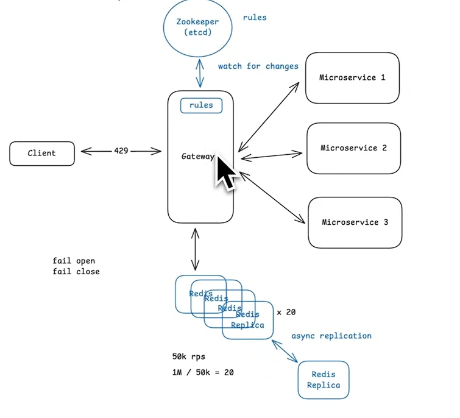

## [Helpful Video](https://www.youtube.com/watch?v=MIJFyUPG4Z4)

## Principles:

1. Fail fast strategy: which means we dont put bad requests into the queue, we directly discard them. --> bcoz puttin into queue is just going to show loading on screen (for eg) and then users will clikc more buttons to get the result which worsens the situation (**retry storm**).
2. Failure Modes:

   - Fail Open: this basically means that the rate limiter failed, and now all the requests are accepted.
   - Fail Close: this basically means that the rate limiter failed, and now NO requests are accepted.
3. Not making rate limiter as part of application code because:

   - It causes code replication
   - We need to keep a common state such as Redis anyways then why have extra bandwidth consumed from each application_code_server to the common redis cache
   - also if it is a malicious request then we dont want it to enter the server and THEN be tested for "rate limiting" - it should be checked outside itself before getting to the application code --> it like a "bouncer", we have to stop everybody outside the club and not when they get inside the club --> just a PROACTIVE measure
4. Throttling:

   - Intentionally slowing down or limiting the request rate for a user is called throttling --> this is done if a user passes/violates the **rate limiter rule**.
   - We identify the user/party who needs to be restricted/throttled using common keys such as: IP Address, User ID, Org ID, API Key, etc
5. Effects of Authentication:

   - For authenticated users we can use user_id as a key to rate limit --> for non-authenticated users: IP_address
   - it can also be a hierarchy of both such as:  Strict limit per IP address for /login endpoint && broader limit per user once logged in
6. **Fixed window algorithm gist: reset the count every window boundary.**
7. **Token Bucket algorithm gist: “I add tokens at a rate” - “I spend tokens per request” - “tokens accumulate up to capacity”.**

   - We need to have an expiry for every bucket such as - expire after 10-60 minutes of inactivity. --> so that we only have buckets in MEMORY of the users that are concurrently active/online
   - we might implement this using a simple "HASHMAP" in redis which keeps a track of the user_id and gets the count in bucket after a request is recieved
8. Multiple Buckets:

   1. Single Endpoint Multiple Rules
   2. Distributed Architecture where we need
   3. Hierarchy of buckets where we allow only 100 request for /abc -- but 50 for /abc/x/ and 30 for /abc/y/

## How to make it Distributed:

1. Redis Cache: Used for cache

   - Rate-limit logic (Token Bucket, Fixed Window, Sliding Window) runs as **Lua scripts** on Redis. Single round-trip, atomic execution—avoids multiple Redis calls per request and guarantees correct behavior under concurrency.
2. Sharding: we need to divide the data such that it can be stored in different Redis Cluster --> this can be done using User_id --> using consistent hashing --> and hence we can use multiple redis cache instances
3. In reality we **DONT NEED MULTIPLE REDIS CACHE** --> we can use a **REDIS CLUSTER** bcoz it facilitates the sharding and distribution across multiple **Redis Cache Nodes**

   - 50k records under 1 shard

## Consistency

1. What happens if redis fails? --> We need to maintain **"RELICATION FACTOR"** such that if any redis nodes goes down, it can be replaced with a node
2. Async replication --> at a given point in time it is not required for every replica to match state with the actual working copies (primary) --> therefore you can create and update the replicas ASYNCHRONOUSLY.

## Latency

1. Connection pooling for avoid gateway <--> redis TCP pooling
2. WE can setup edge servers/api gateway --> edge servers tend to have limited access to ground truth, such as databases and business logic --> Common thing run on edge servers: Static content TLS termination, load balancing for direct traffic to nearest healthy origin region.

```cpp
Edge = fast, global, limited, defensive
Origin = full power, trusted, owns data, source of truth

Edge = bouncer + valet + receptionist.
Origin = kitchen + vault + accountant.
```

## How to handle dynamic rule changes --> bcoz we DONT WANT to change and redeploy

We can keep a service like **Zookeeper** where its complete task is to push any changes in the rules that it contains to the API gateway. So, we do not need to constantly keep on pulling the current rule config from any file nor do we need to redeploy with new configs. If there is any change, developers can change it in the Zookeeper, and then for the upcoming requests, it will be pushed to the API gateway, and the upcoming requests will be tackled according to it according to the new config.


## Architecture from Video


