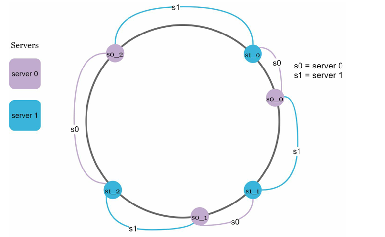

We will be working in distributed systems all the time so we need to make the data distributed too - that too across servers --> we will using **CONSISTENT HASHING** so that we **EVENLY** distribute the data across all servers.

## The Problem:

I think there are two problems when normal hashing fails and redistribution happens :
1. keys under the server which went down && keys under server which was still up are redistributed due to the change in hash function --> leading to lot sof changes and misalingnment with cache and hence --> **leading to lots of cache misses**.
2. Also after all the redistribution, the keys **might not be evenly distributed**, which they were priorly.

## Consitent Hashing - Vanilla

1. Assume the complete hash range from x0 to xn, where x0 to xn are basically the empty slots. Assume that they are in a ring fashion such that we joined the x0 and xn which were previously on a single line.
2. We first **map the servers** onto the ring using something like **their IP address ||  server name**.
3. Then we can map the cache keys onto the ring using the same hash function.
4. To find where the given key is located --> we first find the location of key and then go **CLOCKWISE in the ring to find the NEXT SERVER**.

#### MAJOR Advantage over normal hashing: Adding a server or removing a server leads to Redistribution of only **k/n keys** where k is the number of keys, and n is the number of slots.

#### MAJOR Disadvantages of VANILLA Consistent Hashing

1. Impossible to keep the size of server partitions the same --> REMEMBER: the size of a server partition is basically the total circumference of a ring between that server's position and the previous server position on the ring.

2. Uniform key distribution after the redistribution is difficult.

## Consistent Hashing with Virtual Nodes

- Virtual nodes are basically added on the ring which REPRESENT an actual server. For example: Instead of using s0 only --> we have s0_0, s0_1, and s0_2 to represent server 0 on the ring.

- As the number of virtual nodes increases, the distribution of keys becomes more balanced.This is because the standard deviation gets smaller with more virtual nodes, leading to balanced data distribution.

- However, more spaces are needed to store data about virtual nodes.
This is a tradeoff, and we can tune the number of virtual nodes to fit our system requirements

#### Algo for finding affected ring area after a server is added or removed

1. Get location of altered server on the ring(added or removed) --> consider this Server_A.
2. **Traverse from that location in an ANTI-CLOCKWISE fashion on the ring UNTIL we find a server** --> consider this Server_B.
3. All keys in that postion of the ring are affected i.e. from Server_B to Server_A.

---

## Additional Stuff

### 1. Where is Consistent Hashing Used?

1. **Distributed cache** (Memcached/Redis sharded)

   * Map `key → cache shard`
   * Minimize cache misses when scaling in/out
2. **Sharded databases / KV stores**

   * Map `key → partition`
   * Reduces data reshuffle during resharding
3. **Rate limiter sharding**

   * Map `user_id → limiter shard`
   * Ensures all requests for a user hit same shard (accurate counters)
4. **Load balancing with “sticky routing”**

   * Map `user/session → backend`
   * Preserves locality (cache warmness)
5. **Message queues / stream partitions**

   * Map `key → partition` to preserve ordering per key

### 2. Hot keys and skew

Even with virtual nodes, you can still get:

* **hot keys** (one key hammered by traffic)
* uneven request distribution even if key distribution is even

Two different skews:

1. **Key-space skew**: some shards get more keys
2. **Access skew**: some keys get 1M QPS and dominate a shard

Mitigations interviewers like:

* **replicate hot keys to multiple shards** (read-heavy caches)
* “power of two choices” (choose less loaded among two candidate nodes)
* local in-process caching for hot keys

### 3. Virtual nodes tradeoff — what actually matters operationally

1. **More vnodes → better balance, smoother resharding**
2. **But** --> 
   * larger ring metadata
   * more CPU for lookups (though still cheap)
   * more complicated rebalancing bookkeeping

Therfore number of virtual nodes should be **“Enough to smooth variance; common values are tens to hundreds per node, tuned empirically.”**

---

# Interview Tips:

### 1. The real property of affected keys

It should not be outright **“only k/n keys move”** but an interview-grade statement is:

> ### When adding/removing 1 node among N, **only ~1/N of keys remap** (in expectation).

That “in expectation” is important — and it sets you up to talk about variance and virtual nodes.

### 2. Relication with consistent hashing

For fault tolerance, many systems store each key on **R successors** in the ring.

Example: replication factor R=3
Key is assigned to:

* first node clockwise = primary
* next 2 nodes clockwise = replicas

Benefits:

* node failure doesn’t cause data unavailability
* reduces cache miss spikes

### 3. Applying Template

Whenever you design something that needs sharding, say:

1. **Choose partition key**

   * e.g., `user_id` for rate limiting
2. **Use consistent hashing to map key → shard**
3. **Keep ring membership in service discovery lke ZooKeeper/etcd**
4. **Use virtual nodes for balance**
5. **Use replication factor R to handle failures**
6. **Handle rebalancing**
   * warm-up cache / backfill data