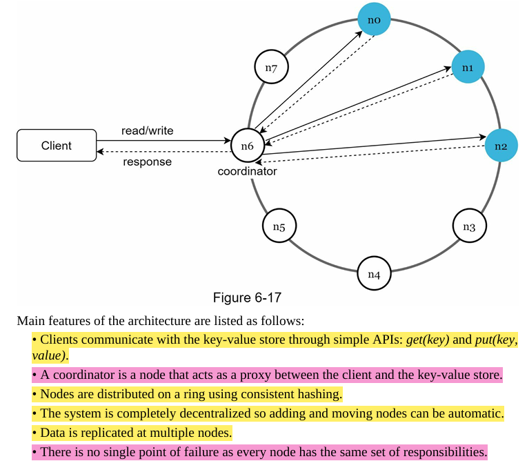
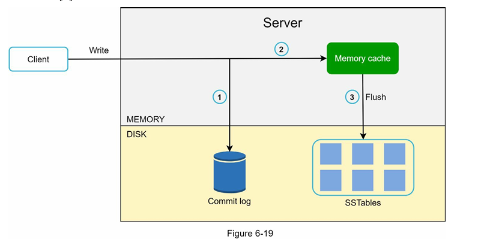
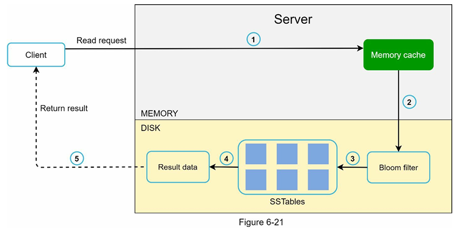

# 1. Basics

- Due to performance reasons, short key works better.
- Generally, in key-value stores, the value is an OPEC object, such that we generally don't tend to enforce data types on the value, so it can be anything. It can be a JSON string or anything, though in DynamoDB and Cassandra-like services, they have a few options for enforcing a type on it.
- KV Stores **CAN HAVE A FEATURE OF tunable consistency**. The tuning part is wrt NWR. Though all services dont offer this feature.

# 2. Single server key-value store

- implement using a hash table
- Optimize for space using:
  - data compression
  - keeping frequently used data in memory & rest on disk
- But Even with optimisation, a **single-server KV store can reach the ceiling very quickly**, and that's why we need a distributed KV store.

# 3. CAP Theorem

The CAP theorem states that it is **impossible for a distributed system to provide more than two out of the following three guarantees at the same time**: consistency, availability, and partition tolerance. Here are some definitions:

1. Consistency: all clients see the same data at the same time, regardless of which node they connect to.
2. Availability: every request receives a response, even if some of the nodes in the system are down.
3. Partition tolerance: system’s ability to continue operating even if there are communication breaks (network partitions) between nodes.

##### we know that one of them "Needs to go blud!"

#### Since network failure is unavoidable, a distributed system must tolerate network partition; thus, a CA system cannot exist.

- Therefore, we only have two options remaining: CP and AP systems:

  1. CP (consistency and partition tolerance) systems: a CP key-value store supports consistency and partition tolerance while sacrificing availability.
  2. AP (availability and partition tolerance) systems: an AP key-value store supports availability and partition tolerance while sacrificing consistency.

# 4. Data partition & Data replication

- use consistent hashing
- With virtual nodes, the first N nodes on the ring may be owned by fewer than N physical servers. To avoid this issue, **we only choose unique servers** while performing the clockwise walk logic **for replication**.

# 5. Consistency

### Consistency Models

- Strong, weak, and eventual
- We are suggested to use, and also would tend to prefer **eventual consistency** in our KV store designing, which is similar to what DynamoDB and Cassandra use. --> In such case the client can get inconsistent values and **IS FORCED TO RECONCILE**.

### N - W - R principles

1. **N = Replication factor** ~ the number of replicas
2. **W = Write quorum of size W** ~ For a write operation to be considered as successful, write operation must be acknowledged from W replicas.
3. **R = Read quorum of size R** ~ For a read operation to be considered as successful, read operation must wait for responses from at least R replicas.

# 6. Inconsistency resolution: versioning

#### STILL DONT KNOW THIS: Did not understand anything about version clocks.

# 7. Handling Failures

### 7.1 Failure Detection

- All-to-all Multicasting
- Gossip Protocol

### 7.2 Handling Temporary Failures

##### COMMON SITUATION: Let's say a data item has a replication factor of 3 and we have four servers, S1, S2, S3, S4, and it was supposed to be on S1, S2, S3 (PREFERENCE LIST). Assume that the request goes to S3 and S3 is down.

#### Strict Quorum approach:

1. The NWR quorum are enforced strictly - so if the S3 is down STILL, the incoming request should go to the EXACT 'N' servers in the preference list, that is, to s1, s2, and s3.
2. In this case, we will need to wait until s3 recovers --> after which the request will go to s3 --> As it is **strictly** enforced, only after s1, s2, and s3 **all of them** recieved it, it will be considered a success --> Till then, no other requests.

#### Sloppy Quorum:

1. The NWR quorum are enforced sloppily - so if the S3 is down STILL, the incoming request can go to other servers and We **don't essentially need all the n servers** to acknowledge success.
2. **An Additional SUPERPOWER THAT WE HAVE OVER HERE is that IT IS OKAY OF THE SERVER IS NOT EVEN FROM THE PREFERENCE LIST.** --> IN THAT CASE WE USE HINTED HANDOFF.

### Important: Hinted Handoff + Sloppy Quorum:

1. SITUATION: If a server who recieved the request is down, we choose the next healthy server in the ring. This has nothing to do with if it was in the **PREFERENCE LIST OR NOT**. For example, let's say a data item has a replication factor of 3 and we have four servers, S1, S2, S3, S4, and it was supposed to be on S1, S2, S3 (PREFERENCE LIST). Assume that the request goes to S3 and S3 is down.
2. SLOPPY QUORUM IN PLAY: In this case, even though S4 was never supposed to get the data, it will still choose S4 because it is the next healthy server in the cycle.
3. HINTED HANDOFF IN PLAY: When S3 recoevers, S4 will give that data back to S3 which is called hinted handoff.

#### 7.3 Handling Permanent Failures

- Anti Entropy protocol → Implemented using a Merkle tree
- Build Merkle trees recursively for Two states of data may be in different servers.
- Traversal:
  - And then, to verify the consistency of data, we compare the root node of both the Merkle trees.
  - If the hash does not match, then we go one level down and then compare both the hashes again.
  - Whichever node does not match the other node, that is the node we traverse.
  - That's how we find the path to traverse down both the state trees, and then, by reaching the leaf node, we can find the exact **DATA HASH RANGES** which are inconsistent --> HENCE THE DATA IN THESE RANGES (values in kv pairs) will have some inconsistencies.

#### 7.4 Handling Data Center Outage

Need to replicate data across data centers - Vanilla shit!

# 8. System Architecture Diagram

##### Tasks are:

##### 1. Handle client API
##### 2. Storage engine
##### 3. Replication
##### 4. Conflict resolution
##### 5. Failure detection
##### 6. Failure repair mechanism

###### Note: We have a theoretically similar, coordinator-like node, present in DynamoDB and Cassandra architectures.

# 9. Write Path

1. We write the request details in a commit log file.
2. Data is saved in the memory cache.
3. Whenever the memory cache is full or reaches a predefined threshold, we flush all of data to SSTables

# 10. Read Path

1. We check the memory cache. If it's there, we get it because that will be a cache hit || else it's a cache miss.
2. If it's a miss, then we use the bloom filter to check in the SSTables.
3. We get the actual location where the data might be on SSTables.
4. We get resultant data from SSTables and we return it to the client.
