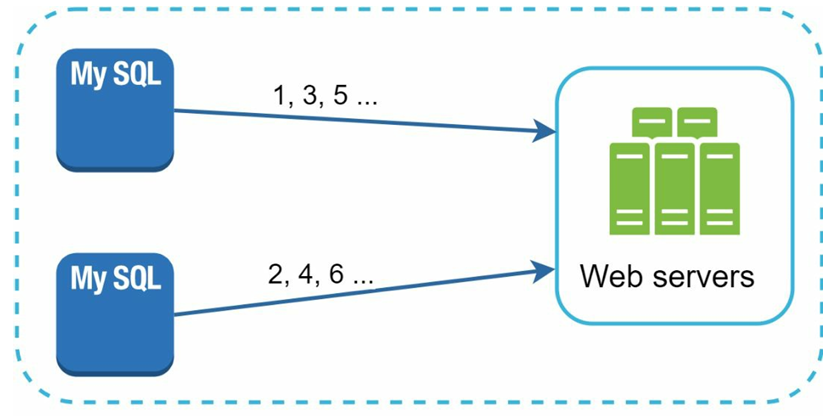
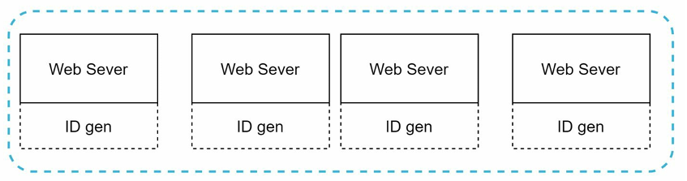
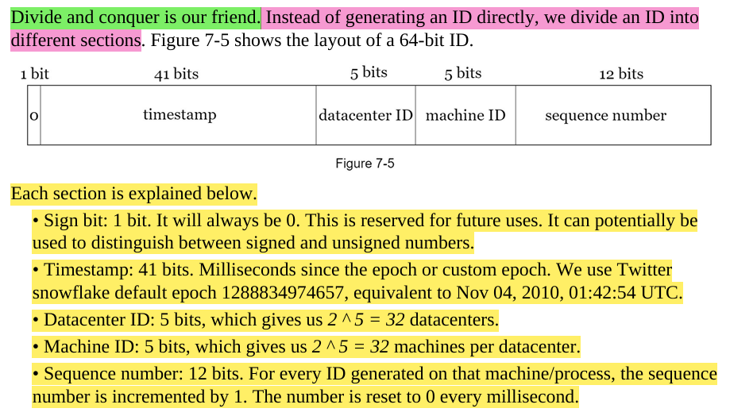

# Functional & Non-functional Requirements

1. (f1) IDs must be unique.
2. (f2) IDs should be numerical values only.
3. (f3) IDs must fit within 64 bits.
4. (f4) IDs must be ordered by date.
5. (nf1) The system should support generating over 10,000 unique IDs per second.

# 1. Multiple options to be considered

## 1.1 Multimaster Replication

- Similar to keeping a count of current ID and auto incrementing --> but not by 1
- we increment the ID by number of servers so that overlapping IDs don't get generated.
- HENCE: Instead of increasing the next ID by 1, we increase it by k, where k is the number of database servers in use.

##### FROM THE ABOVE FIGURE you can see that: next ID to be generated is equal to the previous ID in the same server plus 2

## 1.2 Universally Unique Identifier (UUID)

- UUID is a 128-bit number used to identify information in computer systems.
- They can be generated independently WITHOUT coordination between servers.

- They dont follow our requiremnts as they have:
  - alphabets in it
  - 128 bits long
  - IDs cant be sorted and **DONT GO UP WITH TIME**

## 1.3 Ticket Server

- a central server issuing IDs like tickets
- SPOF (Single Point Of Failure)

## 1.4 IMPORTANT --> Twitter Snowflake Approach

##### EACH UNIQUE ID is divided into different parts - something similar to a TCP/UDP packet where every bit has a meaning.

# 2. Design Deep Dive

##### 2.1 Can & How to change data center and machine number?

The data center IDs and machine IDs are set during the startup of the system, which can be at company start, but they can be changed later as well. The migration needs to be done safely. How do we change or maintain them?:

- **Step 1**. Keeping data center ID stable, because they should not change. They rarely change.
- **Step 2**. Assigning machine and worker IDs not by humans. You should not pick a big bus in workers' ID, or basically we don't pick it, but make them; let it be okay.
- **Step 3**. Having a basic safe procedure for scaling and moving out new IDs and rolling out gradually, such that it prevents duplicates.

##### 2.2 Clock synchronization problem and solving it using Network Time Protocol (NTP)

1. A **clock synchronization problem** is basically when different servers or computers or worker nodes in a server have different timings set. By different timings, it can basically be a simple clock drift as well, such that Machine A thinks it's 10:00:00.500 & Machine B thinks it’s 10:00:00.200, so they are off by 300 ms. This can break **global ordering** assumptions and create weirdness in distributed systems.
2. **Network Time Protocol (NTP)** solves clock drift by keeping distributed server clocks **closely synchronized** with true time, minimizing time-related inconsistencies. It works by:

   1. Periodically querying trusted NTP servers for the current time
   2. Measuring round-trip network delay to estimate accurate time
   3. Calculating the local system’s time offset from true time
   4. Gradually adjusting the local clock to stay in sync
