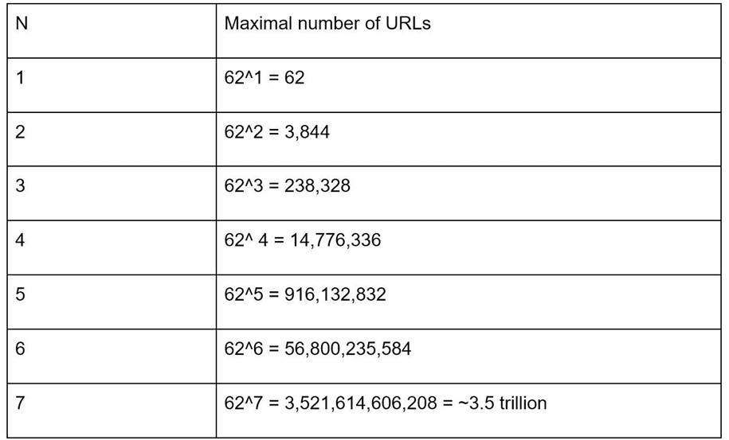
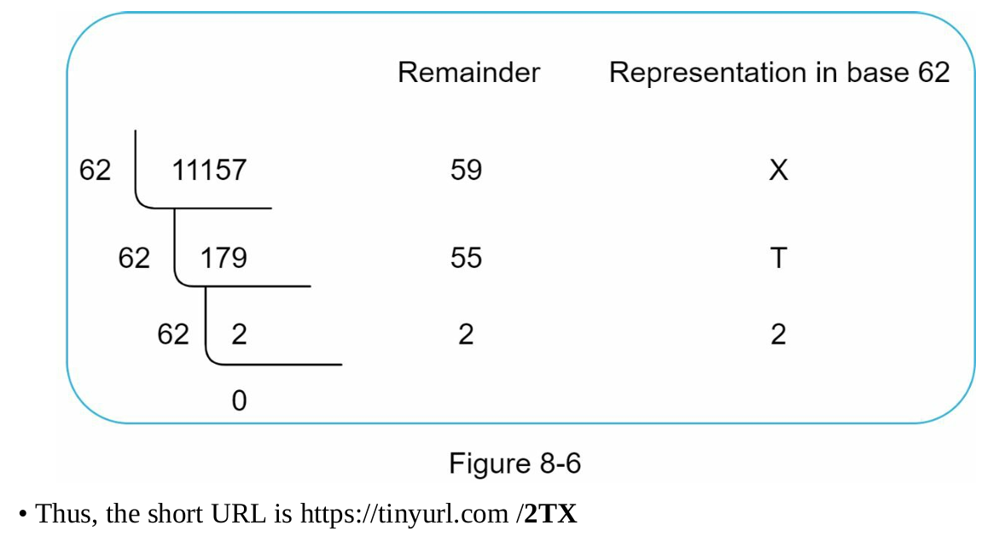
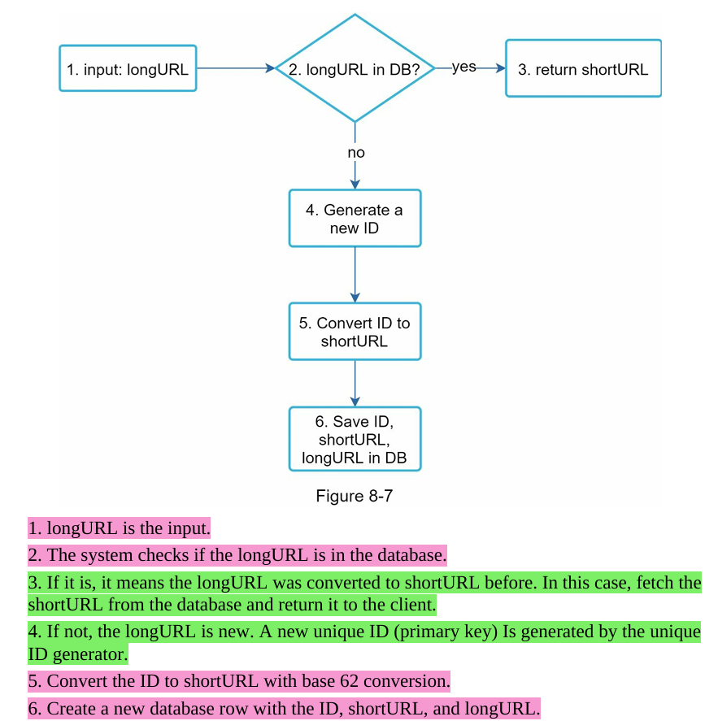
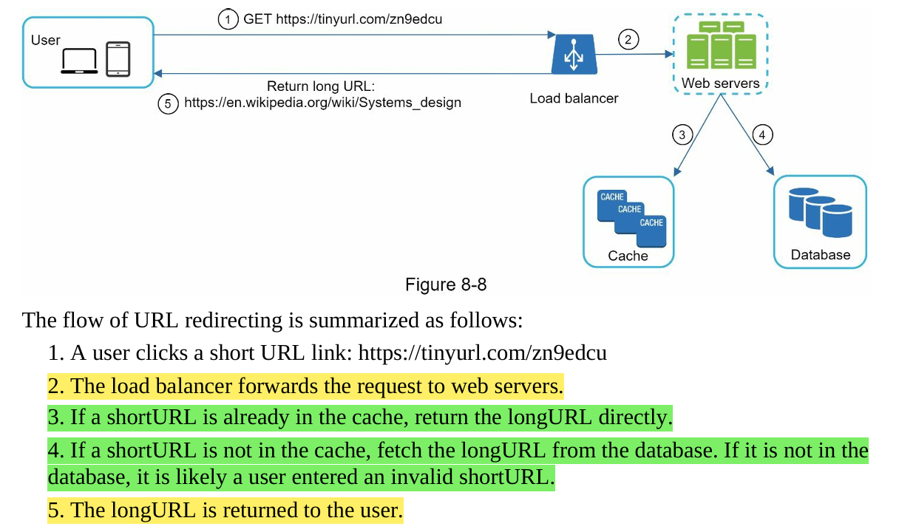
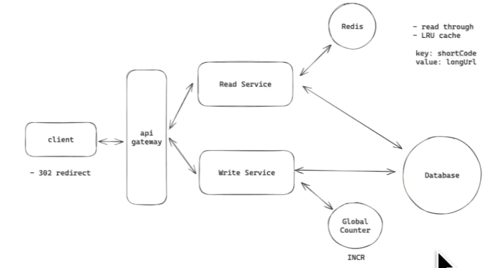

## Functional and Non-Functional Requirements

1. (f1) URL shortening: Given a long URL, return a much shorter URL.
2. (f2) URL redirecting: Given a short URL, redirect to the original long URL.
3. (f3) High availability, scalability, and fault tolerance considerations.
4. (f4) shortened URLs cannot be updated or deleted.

## Random Initial Waffle

- we can store this in a hashmap-like structure but that is generally in-memory storage so we need to make a **similar** setup in persistent storage service like database which provides us key based lookup --> so basically need to: Build the Data model replicating this way

## High Level Design - Getting a Buy In

### Proposing REST-style API endpoints

#### 1. URL Shortening: this is to send the long url and get back a short url

**POST api/v1/data/shorten**
  • request parameter: {longUrl: longURLString}
  • return shortURL

#### 2. URL Redirecting: this is to redirect any request coming towards the short url --> to the actual long url

**GET api/v1/shortUrl**
  • Return longURL for HTTP redirection

NOTE: we have /v1 because it is good SDLC practice to keep versioning upon api endpoints -- similar versioning can be enforced using header versioning and query parameter versioning

### Status Codes

- **301 Redirect:** Indicates that the requested URL has been **permanently** moved to a new location (the long URL). --> Browsers cache the redirect, so future requests **go directly to the long URL without contacting the URL shortening service**.
  - Advantages:
    - Reduces load on the tinyurl service.
    - Maintains SEO quality by avoiding redirects.

- **302 Redirect:** Indicates a **temporary** move to the long URL. --> Browsers do not cache the redirect, so **every request for the short URL is sent to the URL shortening service first**.
  - Advantages:
    - Useful if we want analytics of click rate and source of click.
    - Can be used when the original URL may change again in the future.

Hence based on our use case we will be choosing 301 redirect status code.

## Hash Function deep dive

#### Deciding length of the hash function

- Based on our back of the envelope estimations: we need 365 billion URLs.
- ALSO, we are allowed to use alphanumeric characters for the short URL such as 0-9, A-Z, and a-Z --> Therefore we have 62 characters which we can use.
- Therfore for finding the length of the url needed to satisfy both the conditions we can refer to the following table:

### Hash Function Option 1: Hash + Collision Resolution

1. Famous hashing functions like CRC32, MD5, and SHA1, after hashing a string or a URL, still give the hash value, which is way more than seven characters. How do we make it short?
2. To shorten it, we can use the first seven characters of the hash value only, but first 7 letters can be same --> which can lead to collisions.
3. To resolve hash collisions, we can **RECURSIVELY append a new predefined string to the actual URL**, so that the hash value is unique and it does not collide AGAIN with any of them present in the DB.
4. **How do we do it? Whenever we generate the hash value, before writing it in a DB we query the DB to check if we already have the same value --> if we found the same then we RECALCULATE the hash value for the current string.**
5. This process is very expensive, but it can still be **optimized using a technique called Bloom filters**.

- A Bloom filter is basically a space-efficient probabilistic technique to test if an element is in a number of sets.
- A Bloom filter can say:
  - Definitely not in the set ✅ (no false negatives)
  - Maybe in the set ⚠️ (false positives possible)
- Hence if we get "DEFINITELY NOT IN SET" --> we can skip DB lookup

### Hash Function Option 2: Base 62 Conversion --> WHAT WE CHOOSE

##### 1. For the given long url we generate a UNIQUE ID.

##### 2. Base 62 is a way of using 62 characters for encoding. The mappings are: 0-0, ..., 9-9, 10-a, 11-b, ..., 35-z, 36-A, ..., 61-Z, where 'a' stands for 10, 'Z' stands for 61, etc.

###### Let's consider that the unique id for long url is /11157. --> this is how we shorten it using base62 encoding

# Final Architecture

1. An interesting choice to make is IF WE GET A SAME LONG URL to shorten --> Will we return the already generated short URL or create a new short URL for the same long URL?

- This is a product decision.
- Eg: In sales department: where we expect different employees to share their own URLs of the same company; then in that case we will need different short URLs for the single long URL. Also bcoz we might need to monitor the traffic individually.
- **BUT HERE WE CHOOSE TO RETUTRN THE ALREADY CREATED SHORT URL.**

## Part 1: Shortening the URL

## Part 2: URL Redirecting

# Similar architecture - just  adding microservices

### Further optimizations for individual components:

#### 1. Redis Global Counter (INCR operation):
  - Keep replicas so that the range of the tickets is not lost (since here we have chosen ticketing algo. for UID generation)
  - if not replicas, it can also take **periodic snapshots**

#### 2. Redis Redirecting Cache (read-through cache + LRU):
  - We put a track of its hotkeys in the logs so that if this Redis goes down, we can up a new Redis instance and warm it up using the log.
  - Or we can simply keep replicas
  - **INSTEAD OF REDIS WE CAN ALSO USE CDN - bcoz modern CDNs can cache HTTP requests.So our setup can look like User → CDN → Redirect Service → (Cache/DB)**

#### 3. Database:
  - We will be using indexing so that our database operations are quick.
    - actual index can be stored on disk --> hot part of index can be stored in memory
  - We can also use sharding to make it quicker in which case we will be using conistent hashing for all the different shards.
  - We can also keep replicas of data on different server.