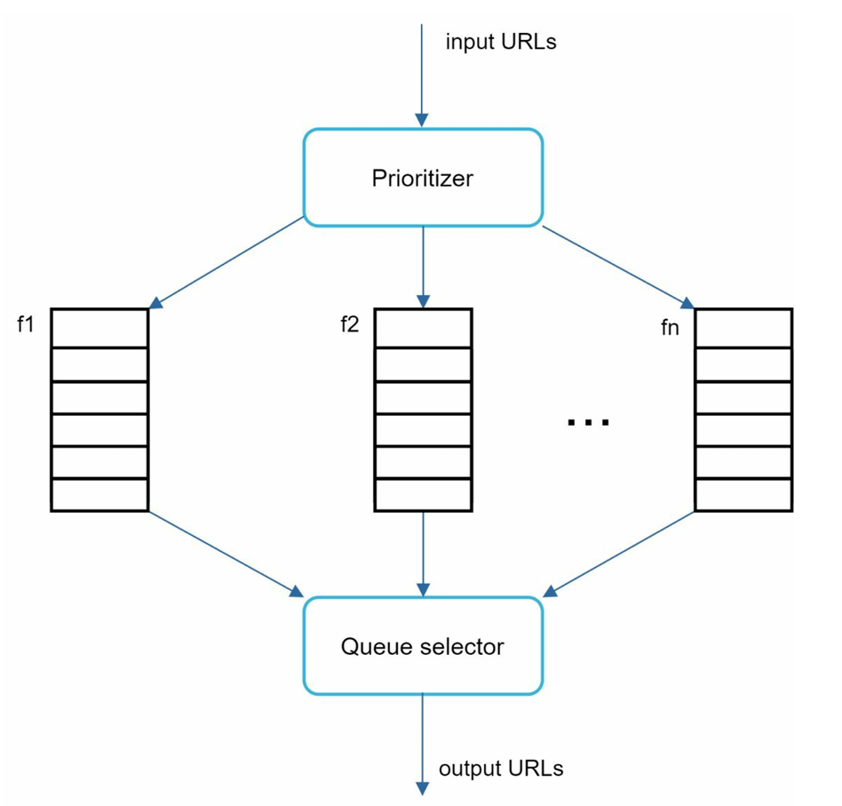
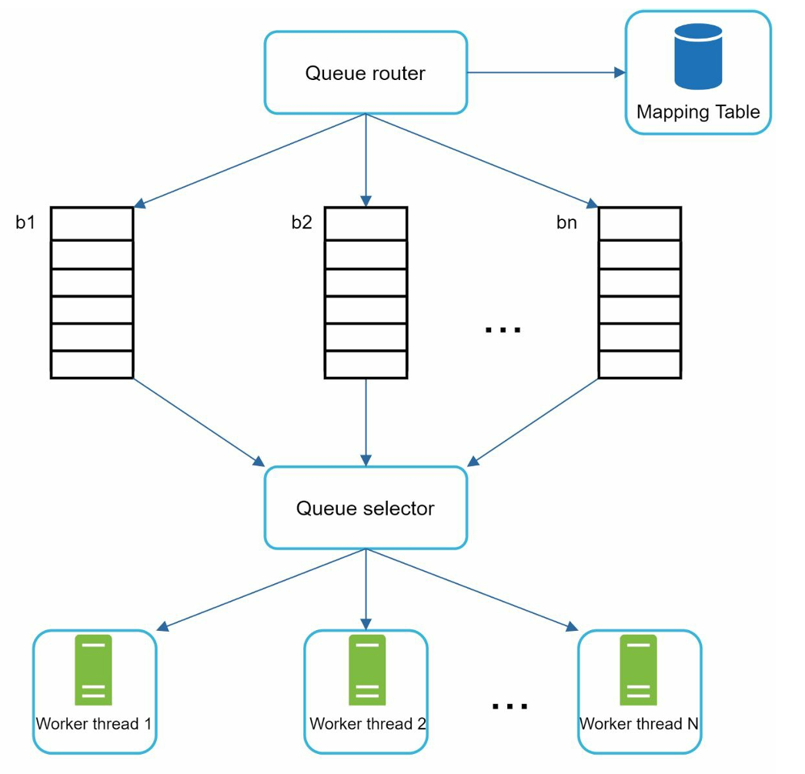
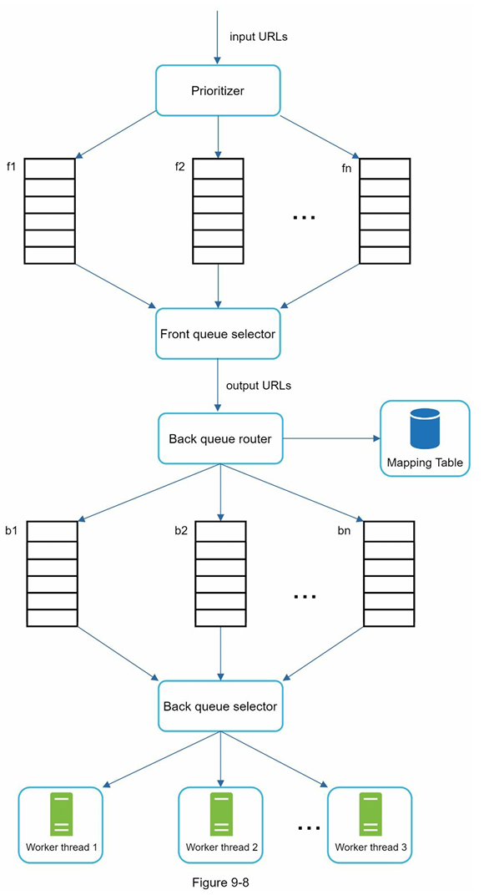
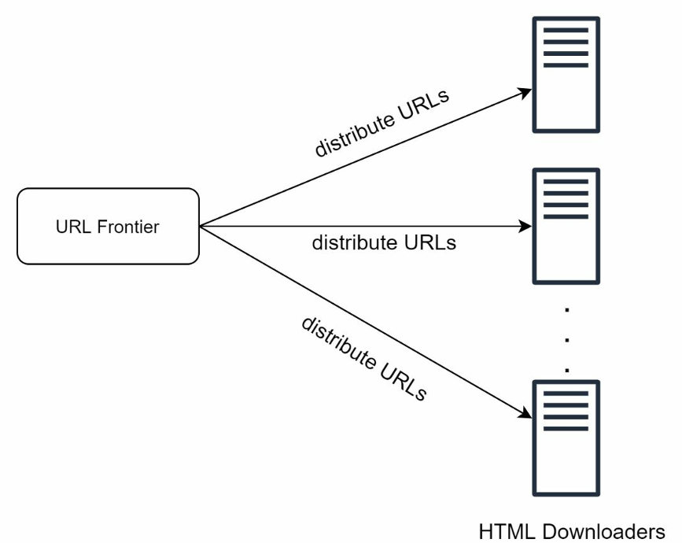

A crawler can be used for different purposes:

- Search engine indexing: A crawler collects web pages to create a local index for search engines.
- Web archiving: This is the process of collecting information from the web to preserve data for future uses. For Eg: many national libraries run crawlers to archive web sites.
- Web mining: Just Data mining to discover useful knowledge from the internet.
- Web monitoring. The crawlers help to monitor copyright and trademark infringements over the Internet.

## Functional Requirements

- scrape the complete html
- currently no need of scraping images, videos or documents
- **PAGES WITH DUPLICATE CONTENT SHOULUD BE IGNORED**

## Non - Functional Requirements

- 1 billion pages per month
- store all the data for 5 years
- high scalability needed --> hence parallelization needed
- EXTENSIBILITY --> Tomorrow, if we need to add crawling for images, we should not need to change the complete architecture.
- politeness to websites needed

## High Level Design - Getting a Buy In

##### Step 1: Add seed URLs to the URL Frontier

##### Step 2: HTML Downloader fetches a list of URLs from the URL Frontier.

##### Step 3: HTML Downloader retrieves IP addresses of URLs from the DNS resolver and begins downloading.

##### Step 4: Content Parser parses HTML pages and checks for malformed pages.

##### Step 5: Once content is parsed and validated, it is sent to the “Content Seen?” component.

##### Step 6: “Content Seen” component checks if the HTML page already exists in storage.
- If it exists, this indicates the same content under a different URL has already been processed; the HTML page is discarded.
- If it does not exist, the content is new to the system and is forwarded to the Link Extractor.

##### Step 7: Link Extractor extracts links from the HTML pages.

##### Step 8: The extracted links are passed to the URL filter.

##### Step 9: After filtering, links are sent to the “URL Seen?” component.

##### Step 10: “URL Seen” component checks if a URL already exists in storage. If it does, nothing further is done.

##### Step 11: If a URL has not been previously processed, it is added to the URL Frontier.

# Deep Dive in Components

## 1. DFS or BFS --> we choose BFS because DFS's depth is crazy

- if there are any other links in the html page we will go forward and crawl them as well

##### for the hyperlinks --> there can be 2 cases:

    1. Type 1: link to website of same domain
    2. Type 2: link to a different website

HOW DO WE HANDLE DIFFERENT TYPES OF HYPERLINKS:

1. Case 1: Type 1 with complete link --> push directly to queue
2. Case 2: Type 1 with RELATIVE link --> add the prefix of website and then push to queue
3. Case 3: Type 2 always be with absolute link --> push directly

###### LOGIC BELOW

- HTML pages can contain URLs in two main formats:

  - **Absolute URLs** (e.g. `https://example.com/a/b`)
  - **Root-relative URLs** (e.g. `/a/b`, which refers to the same host as the current page)
- The Link Extractor should handle:

  - **URL canonicalization** (normalize URLs to a standard form)
  - **URL resolution** (convert relative/root-relative links to full absolute URLs using the context of the current page)
- URL extraction procedure:

  - Determine the base URL of the current page (e.g. `https://news.site.com/section/page.html`)
  - For each hyperlink found:
    - If the link is an absolute URL (starts with `http://` or `https://`), keep it (after canonicalizing)
    - If the link is a root-relative URL (starts with `/`), prepend the scheme and host from the base:
      e.g. `/a` becomes `https://news.site.com/a`

## 2.1 URL frontier priority

**Stage A: Priority stage: Input URLs → Prioritizer → Front Queues (F1, F2, … Fn) → Front Queue Selector**
    - This stage answers: “Among all discovered URLs, which ones are worth considering sooner?”

- The per-host queues + selector acts as a **Tier-1 Politeness** --> **Global per-host constraints** && lets you do:
  - round-robin across hosts
  - weighted fairness
  - “important hosts more often”
  - “don’t starve small hosts”

#### Metrics like PageRank

- A page is important if many important pages link to it.
- If lots of pages link to you, that’s like lots of “votes” saying you matter.
- But not all votes are equal --> a link from Wikipedia is more meaningful than a link from a random ass blog.
- So we have a scoring system like:
  - links from high-quality pages count more
  - **and high-quality pages are those that get links from other high-quality pages**

**The implementation of this circular dependency is recursive and hence calculates PageRank of a page.**

## 2.2 URL Frontier Politeness

**Stage B: Politeness stage: Selected URLs → Back Queue Router → Back Queues (B1, B2, … Bn) → Back Queue Selector → Worker threads**
    - This stage answers: “Among the URLs we want soon, which ones are actually legal/polite to fetch now?”

##### The core trick --> Make the unit of scheduling a host, not an individual URL.

#### each host has a dynamic and host-specific “wait time” --> **decided based of Robots.txt**

- Adding programmatic delays in worker nodes is basically **Tier-2 Politeness** --> This is to manage conditions like imperfect parallel coordination between worker nodes.

- Queues are host-specific. Workers are not.
- The “queue selector” is **NOT AT ALL “pick one host and let everyone drain it.”** --> Instead, the selector is typically doing this:
  - Every time a worker becomes free, it asks the selector: “Give me the next URL that is allowed to be fetched now.”
  - The selector returns a URL from some host queue that is eligible
  - **IMPORTANT So in a single burst, a worker node n can get 5 urls each from different hosts**.

## 2.3 Combined URL Frontier

- Reproducible logic to remember --> **modularization can have different utility views**, just like:

  1. Front queue = importance view
  2. Back queue = host view
- Theoretically, the front queue selector picks one URL at a time from front queues, but in practice it can move URLs in small batches for efficiency.

### Question: What if the number of unique URL hosts is greater than the number of back queues?

- the number of back queues is limited
- a back queue can hold URLs from multiple hosts over time
- **but at any given moment, a back queue is usually assigned to one host**

  ###### At an organizational scale, there can be millions of hosts. Hence, we cannot always have lots of back queues. Therefore, back queues are implemented as a limited pool of active politeness queues. --> **IMPORTANT: Only hosts that are “currently active / currently scheduled” need back queues**.
- lets say a 5th unique url comes and all 4 back queuese are occupied --> we have 2 ways:

  1. **Option A: Keep it in the front queues for now** --> If no back queue is available for a new host, the URL remains in the front system until a back queue becomes free.
  2. **Option B: Spill into an overflow store** --> The system records: “espn.com has pending URLs” but does not assign a back queue yet --> **When a back queue frees up, router binds it to espn and starts transferring URLs**.

### Question: What are worker nodes doing here if we already have a HTML Donwloader component ahead?

- So the worker thread is not a different architectural box from downloader; it is usually **the executor that invokes downloader logic**.
  - URL Frontier = scheduling
  - Worker thread = **consumer of scheduled work**
  - HTML Downloader = actual fetch logic used by worker

## 2.4 Maintaining Data Freshness

1. A crawler has a tradeoff:

   - If you recrawl everything all the time → fresh data, but huge cost
   - If you rarely recrawl → cheap, but stale data
   - So freshness is a **resource allocation problem**.
2. we have 2 choices:

   - 1. **Recrawl based on web pages’ update history**. --> we don’t detect updates before crawling; we predict them based on previous crawls OR OR OR we schedule crawls [daily, weekly, monthly]
   - 2. **Prioritize URLs and recrawl important pages first and more frequently**.

## 2.5 Storage for URL Frontier

- For real-world crawls putting millions of URLs in memory is neither durable nor scalable.
- Keeping everything in the disk is undesirable as well because the disk is slow; and it can easily become a bottleneck for the crawl.
- **We adopted a hybrid approach**:
  1. The majority of URLs are stored on disk, so the storage space is not a problem --> something like the seed url compnent or a persistent storage (refer remarks[1])connected to URL frontier where new URLs are dumped in.
  2. To reduce the cost of reading from the disk and writing to the disk, we maintain buffers in memory for enqueue/dequeue operations --> Front queues and back queues.

## 3. HTML Downloader

- The HTML Downloader downloads web pages from the internet using the HTTP protocol.

## 3.1 Performance Optimization of HTML Downloader: Distributed Crawl

To achieve high performance, crawl jobs are distributed into multiple servers, and each server runs multiple threads. The URL space is partitioned into smaller pieces; so, each downloader is responsible for a subset of the URLs. 

## 3.2 Performance Optimization of HTML Downloader: Cache DNS Resolver

Question. It stated that caching the DNS resolver results is one of the ways of performance optimization. Let's say that DNS might be a bottleneck whenever we get one of the URLs' IP. We should cache the DNS result so that next time our crawlers can actually pick that up from a cache and download to the webpage rather than hitting the DNS resolver again. Just wanted to ask, how do we cache it? What will be the data structure? Let's assume that we will be using Redis, and how do we do it?
- we can cache the DNS results into Redis which is already a distributed key-value pair storage
- *BUT BUT BUT* DNS results are not permanent because:
    - IPs can change
    - CDNs can return different IPs over time
    - load balancing can change destinations
    - failover can move traffic elsewhere
- **HENCE we need to have TTL config on the cached URLs.**

## 4.1 System Optimization: Robustness via Saving Crawl States

1.  A state can be anything like:
    1. What URLs are waiting to be crawled?
    2. What URLs are currently being worked on?
    3. What URLs have already been crawled?
    4. What content has already been downloaded/stored?
    5. What metadata do we know about each URL/page?
    6. What is the recrawl schedule / freshness state?
    7. What partial work might need retrying?

2. Our aim is not to snapshot the pipeline but **PERSIST HANDOFF POINTS**.

3. Example State model:
    - Durable stores:
        - Frontier store: pending, leased, visited, recrawl schedule
        - Fetch log store: per-URL fetch attempts, status, headers, hash
        - Content store: raw HTML / parsed text / content blobs
        - Metadata DB: URL state, timestamps, canonical URL, content fingerprint
        - Seen stores: URL seen, content seen

    - Recovery logic: 
        - worker lease expires → URL returns to frontier
        - fetched-but-unparsed HTML can be reparsed
        - parser emits discovered links idempotently
        - content storage keyed by content hash avoids duplicates

## 4.2 System Optimization: If there is server-side rendering

Pages having server-side rendering generally may return a minimal shell like: empty 

, JS bundles, OR API calls that populate content later.

We have 2 options to handle this:

1. Website uses SSR:
    - The website itself renders HTML on the server before sending it.
    - This does not cause us any problem because the crawler receives complete HTML.

2. Crawler performs rendering:
    - If the site is client-rendered, the crawler may use a headless browser or rendering engine to execute JS and obtain the final DOM.

## 4.3 System Optimization: Database replication and sharding

- Must-have replication
    1. URL Frontier persistent store
    2. Visited URL / seen store (persistent and/or replicated)
    3. Metadata database (persistent and/or replicated)
    4. Content/object store (usually already durable/replicated)

- Likely sharding at scale
    1. Frontier store — shard by host/domain hash
    2. Seen URL store — shard by normalized URL hash
    3. Metadata store — shard by URL/content ID
    4. Content fingerprint store — shard by fingerprint hash

- Usually not first place to optimize
    1. DNS cache
    2. small ephemeral caches
    3. low-value temporary buffers

# REMARKS

[1]. If "seed urls" is just a set of urls then --> url frontier will have some type of persistent storage attached |||||| if not then it means that "seed urls "is absically a storage which initially was filled with seed urls and now NEW URLS can be appended to it (storage or a queue like structure)

[2]. Using the "content scene?" module is a product decision --> **AND HENCE NEEDS TO BE CLARIFIED IN REQUIREMENT PHASE** --> because there might be cases in which, even if the content is similar, we would need to crawl & scrape it. For example: a same article is on the New York Times as well as Times News, we still want it because we want to say that the same article was published by n number of news outlets. Another example: For web archiving, we need to store the similar articles on different websites.

[3]. *ALSO ALSO ALSO -->* if the only aim of the "content seen?" module was to NOT HAVE similar content scraped again then the hash of the web page is not useful, because let's assume that there will be some minor tweaks, but those tweaks are going to change the hash. It's still going to look at it as two different articles. --> **In this case, we might need to chunk it and then perform a hash**. **If the hashes of the majority chunks are similar, then we can say that2 articles are similar and dont need to be saved**. - there can be a threshold of percentage of chunks. -->  ALSO there can be **completely different approach** of a **SIMILARITY SCORE** which can be implemented using a **vector DB**.

[4]. When we want to use **Queues** we should tend to use a --> **Durable Queue**: It is a queue where, after you enqueue(), the system makes sure the item is stored in **non-volatile storage** (disk/SSD or replicated storage) --> this provides durability, not just simple persistence (storing on disk) but DURABILITY such that even if the system crashes, the data remains.