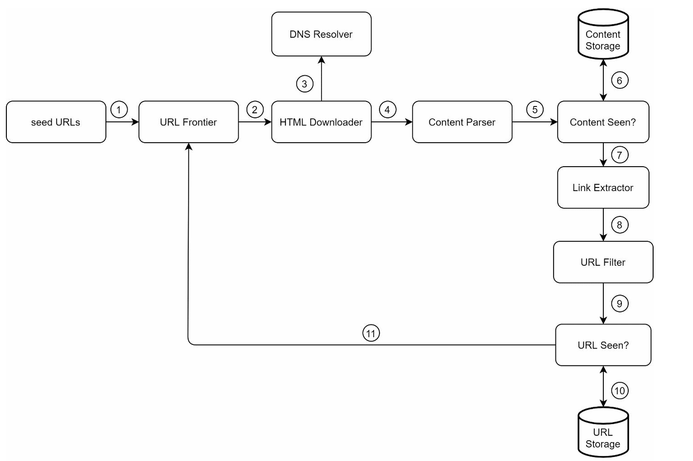

A crawler can be used for different purposes:
- Search engine indexing: A crawler collects web pages to create a local index for search engines.
- Web archiving: This is the process of collecting information from the web to preserve data for future uses. For Eg: many national libraries run crawlers to archive web sites.
- Web mining: Just Data mining to discover useful knowledge from the internet.
- Web monitoring. The crawlers help to monitor copyright and trademark infringements over the Internet.

## Functional Requirements
- scrape the complete html
- currently no need of scraping images, videos or documents
- **PAGES WITH DUPLICATE CONTENT SHOULUD BE IGNORED**

## Non - Functional Requirements
- 1 billion pages per month
- store all the data for 5 years
- high scalability needed --> hence parallelization needed
- EXTENSIBILITY --> Tomorrow, if we need to add crawling for images, we should not need to change the complete architecture.
- politeness to websites needed

## High Level Design - Getting a Buy In

**Step 1:** Add seed URLs to the URL Frontier  
**Step 2:** HTML Downloader fetches a list of URLs from URL Frontier.  
**Step 3:** HTML Downloader gets IP addresses of URLs from DNS resolver and starts downloading.  
**Step 4:** Content Parser parses HTML pages and checks if pages are malformed.  
**Step 5:** After content is parsed and validated, it is passed to the “Content Seen?” component.  
**Step 6:** “Content Seen” component checks if a HTML page is already in the storage.  
        - If it is in the storage, this means the same content in a different URL has already been processed. In this case, the HTML page is discarded.  
        - If it is not in the storage, the system has not processed the same content before. The content is passed to Link Extractor.  
**Step 7:** Link extractor extracts links from HTML pages.  
**Step 8:** Extracted links are passed to the URL filter.  
**Step 9:** After links are filtered, they are passed to the “URL Seen?” component.  
**Step 10:** “URL Seen” component checks if a URL is already in the storage, if yes, it is processed before, and nothing needs to be done.  
**Step 11:** If a URL has not been processed before, it is added to the URL Frontier.  

# Deep Dive in Components

## 1. DFS or BFS --> we choose BFS because DFS's depth is crazy

- if there are any other links in the html page we will go forward and crawl them as well
##### for the hyperlinks --> there can be 2 cases:
    1. Type 1: link to website of same domain
    2. Type 2: link to a different website

HOW DO WE HANDLE DIFFERENT TYPES OF HYPERLINKS:

1. Case 1: Type 1 with complete link --> push directly to queue
2. Case 2: Type 1 with RELATIVE link --> add the prefix of website and then push to queue 
3. Case 3: Type 2 always be with absolute link --> push directly
 
###### LOGIC BELOW

- HTML pages can contain URLs in two main formats:
    - **Absolute URLs** (e.g. `https://example.com/a/b`)
    - **Root-relative URLs** (e.g. `/a/b`, which refers to the same host as the current page)

- The Link Extractor should handle:
    - **URL canonicalization** (normalize URLs to a standard form)
    - **URL resolution** (convert relative/root-relative links to full absolute URLs using the context of the current page)

- URL extraction procedure:
    - Determine the base URL of the current page (e.g. `https://news.site.com/section/page.html`)
    - For each hyperlink found:
        - If the link is an absolute URL (starts with `http://` or `https://`), keep it (after canonicalizing)
        - If the link is a root-relative URL (starts with `/`), prepend the scheme and host from the base:  
          e.g. `/a` becomes `https://news.site.com/a`

## URL FRONTIER POLITENESS

Question: So, as I've attached the image of URL frontier, I can see the diagram. We have a queue router, B1, B2, and Bn, where each queue is a FIFO queue and each queue contains URLs from the same host. I think the host here means one of the driver codes. I don't know; I definitely think that it is not like a website host, because in the table I'll attach that as well, it says that we have a mapping for hosts with queues, such as:
- B1 will have wikipedia.com
- B2 will handle apple.com
- Let's say Bn will have nike.com  Based on that, I think the host here means a website. Based on B1 and B2, let's say we have B3 for nike, we will have a queue selector. Based on some selection logic, it will choose one of the URLs next to be passed. Let's say it chooses B2, which was apple.com, and it gives its respective first node from the queue to one of the worker nodes. Let's say it gives it to worker thread three. What I can see over here, and I want you to code this worker thread one, two, and n, is that a worker thread downloads web pages one by one from the same host. A delay can be added between two download tasks. First of all, I want you to explain to me why we need to again add a delay in the worker node as well. Is my grander question, wasn't all of this possible using a simple lag in a code? Let's say we get a URL from apple.com and we add a simple lag, let's say, for example, five seconds, and then pass it again. We get an Apple; we again add a lag. I just think that B1, B2, B3, like all this logic, I get the point of Q selector logic, because we will have some logic for selection. Again, that's the only reason we are doing that is to slow down and provide a little breathing space for the website servers. I think all of this architecture could just be bypassed by having Qrouter and then worker threads only, in which we have programmatically given some delay for every request. Why does that not work? Why do we have to do all this over engineering just to induce delay? Even after doing all this, like three different queues and all of this, we still need to go into worker thread. As they have said, in those worker threads we need to programmatically add delay. Why then? Why all of this? I don't understand the use

## URL frontier priority

Question: It says that the URLs can be prioritized based on usefulness, which can be measured using PageRank. What is PageRank?

## Combined URL Frontier

I have a main question. I think you should answer this based on the complete diagram that we have. I get and I understand the complete part of the prioritization area of the complete system of URL frontier. I'll give you an example. Let's look at the input URLs. Let's say I give you 20 different input URLs, which are basically from 7 different websites. For one website, we can have three; for some other website, we can have maybe five, whatever. In total, we have 20 different URLs from 7 different websites. It gets into the prioritizer. I do not care who, how many levels of priorities we have set (that is F1, F2, FN). I don't care what FN, or basically N in this state, is. Let's say we have three different priorities, and then we have a front queue selector. I am assuming that it is going to choose three URLs at a time, or maybe I'm not assuming that to be sure. I think that it will choose some N number of URLs, to be honest. Let's say it chooses five URLs. Maybe sometimes it will choose; I don't know what's the logic behind it, because I think you need to tell me that as well, because how many does it choose, or does it just choose one of the queues and then choose its front node? Does it do only one at a time? I need to understand that. If it's one, it's all right, but let's say it does a multiple. Those multiples go to the back queue router, which is basically starting off the politeness part of the system now. Here earlier they have mentioned that b1, b2 to bn are given or are mapped for each of the websites. Let's say our front queue selector gave five different URLs, and we had only initialized or we only have in a system before, so which means we can only handle four different websites at a time. For these five URLs, let's assume that all five of them are from different websites. When we go into the BackQ router, it will distribute them among B1s and B1, B2, B3, B4. What happens when the fifth URL that we have does not have a queue for it? That can't be passed. I know a simple answer can be that we would not be structuring our code or structuring a system in such a dumb way that we can select five URLs at a time and we will only have four queues in front of it. Obviously we are not going to do that. My question also stays that then are we actually deciding or hard coding these numbers before? If not, maybe the second question would be: does this hold the numbers? Does it manage the number of mappings that are possible? That's the question. Let's say it makes sure that every time maybe a new URL comes in, I am going to map something to the four queues that I already have. Assuming that these five URLs were the first of the kind, it's going to map them again to be one of the BQs. It might be possible that there are already URLs present in B1 which belong to other sites. I just don't know how it's going to work with different types of URLs, like URLs from different websites all together.

Question: In the diagram at the end, we can see worker thread one, worker thread two, and worker thread three. It says that worker threads download web pages. If worker threads do that and all of this is a part of the URL frontier, then what does the HTML downloader do? Also, this cannot be part of the URL frontier. That's what I believe because we do not have the DNS yet, because the DNS resolver is accessible to the HTML downloader component. After resolving DNS, we can download the web page, right? What's up? I don't get it.

## Freshness

So question: For maintaining the freshness, because we would like freshness in the data that we have crawled upon, we have got it by crawling upon the websites. How do we maintain the freshness, as websites get updated all the time? One of the strategies mentioned over here is recrawl based on web pages' update history. Can you tell me how we are going to do that? Is there a simple way that we can understand by code, like maybe something like a very naive inspect element thing where we can understand when this website was updated last? Is there anything like that? I know a simple thing can be to go to the website, crawl everything, get the complete text hash, and compare it with the already present. Again, then we will be doing all of this for all the websites, all the web pages, so that is basically a big off-solution. How do we only recrawl the updated web pages, because that's going to be something optimal? That's why I don't understand this strategy. The second strategy makes more sense. It says to prioritize the URLs and recrawl important pages first, and that's the one thing you do more frequently, which makes sense. I can then accommodate those numbers. It is all right to crawl selected URL pages rather than crawl all of them to find if they are updated, and if yes, we do the thing. I didn't really get the first one, which was: I'll quote again, and you should do recrawl based on web pages' update history. How do we do that?

## Distributed crawl
Question again over here. We can say that, and I want you to quote it: the URL space is partitioned into smaller pieces, so each downloader is responsible for them. This makes sense again. I just wanted to confirm that the URL frontier job is to get a bunch of URLs from the seed URL component, which is basically a storage. From there, it is supposed to prioritize them and then it is supposed to schedule them to worker nodes. Again, I don't understand why worker nodes are part of the URL frontier, because it will be part of the HTML downloader component, right? If it is not that way, then how are we already downloading the HTML, like an HTML webpage, in the URL frontier component? If that is true, then what's the point of the HTML downloader component? Also, if that is true, then in the diagram that I am attaching right now, it says URL frontier distributes URLs to HTML Downloaders. That should be right, because that's the job that URL frontier is supposed to do, which means distributing URLs or sending URLs. Can be a job of the worker nodes? It cannot be. As URL frontier is distributing, you are distributing URLs to HTML Downloaders. It means that we have not yet downloaded the web pages, so I think there is some discrepancy. Earlier, I want you to hear this with great attention, that earlier it said that worker nodes download web pages, and that's the complete point of confusion!

## Cache DNS Resolver

Question. It stated that caching the DNS resolver results is one of the ways of performance optimization. Let's say that DNS might be a bottleneck whenever we get one of the URLs' IP. We should cache the DNS result so that next time our crawlers can actually pick that up from a cache and download to the webpage rather than hitting the DNS resolver again. Just wanted to ask, how do we cache it? What will be the data structure? Let's assume that we will be using Redis, and how do we do it?

## Robustness

Book: Save crawl states and data: To guard against failures, crawl states and data are written to a storage system. A disrupted crawl can be restarted easily by loading saved states and data.
So, as you can see, this was written in the book. My only question is, how do we? I understand that we can maybe log the URLs that were passed, but let's say in the HTML downloader component we have already downloaded the webpage and then it is in content parcel. How do we save the state of the complete crawling pipeline? I understand URLs can be saved and logged continuously. Are we really supposed to log what the content was passed? I don't understand. How do we save the state to make this robust?

# Server Side rendering

Server-side rendering: Many websites generate links dynamically using JavaScript, AJAX, or similar technologies; to ensure we can extract all such links (not just those present in the static HTML), we must first perform server-side rendering (also called dynamic rendering) on each page before parsing it [12].
This was an excerpt from the book. What do we do in this situation?

# Database replication and sharding
Techniques like replication and sharding are used to improve the data layer availability, scalability, and reliability. So this was again an excerpt from the book. What do you suggest? Where should we have database replication and sharding, or maybe just sharding, or maybe where we should have the database in the first place where we do not have it currently? Tell me your thoughts. Again, not to be over-engineering stuff, but I need actual practical ways where it will make sense.

# REMARKS

[1]. If "seed urls" is just a set of urls then --> url frontier will have some type of persistent storage attached |||||| if not then it means that "seed urls "is absically a storage which initially was filled with seed urls and now NEW URLS can be appended to it (storage or a queue like structure)

[2]. Using the "content scene?" module is a product decision --> **AND HENCE NEEDS TO BE CLARIFIED IN REQUIREMENT PHASE** --> because there might be cases in which, even if the content is similar, we would need to crawl & scrape it. For example: a same article is on the New York Times as well as Times News, we still want it because we want to say that the same article was published by n number of news outlets. Another example: For web archiving, we need to store the similar articles on different websites.

[3]. *ALSO ALSO ALSO -->* if the only aim of the "content seen?" module was to NOT HAVE similar content scraped again then the hash of the web page is not useful, because let's assume that there will be some minor tweaks, but those tweaks are going to change the hash. It's still going to look at it as two different articles. --> **In this case, we might need to chunk it and then perform a hash**. **If the hashes of the majority chunks are similar, then we can say that2 articles are similar and dont need to be saved**. - there can be a threshold of percentage of chunks. -->  ALSO there can be **completely different approach** of a **SIMILARITY SCORE** which can be implemented using a **vector DB**.