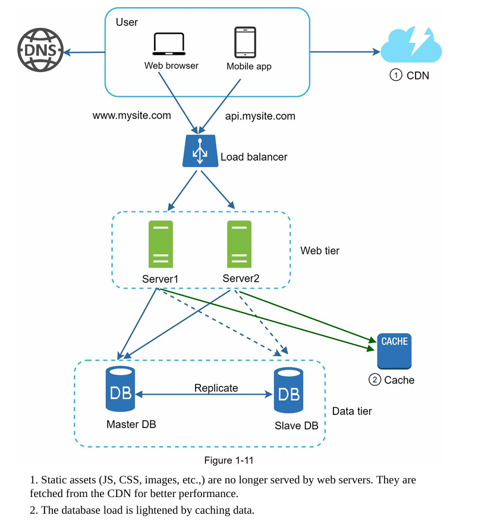
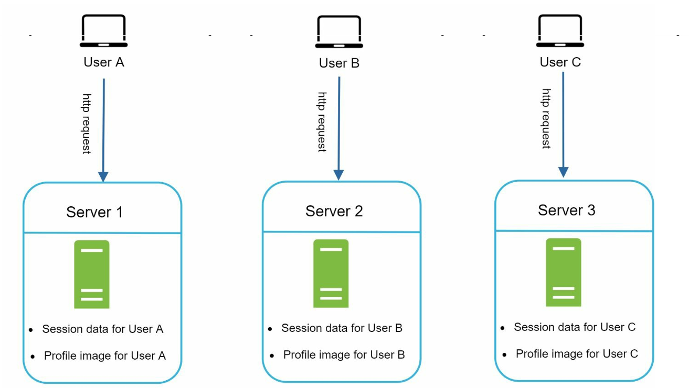

# 2 types of databases

## 1. Relational

### Advantages:

    -it has been legacy and hence most of the services would still be using it
    - alloows join operations

## 2. Non-relational

### Dis-advnatages

1. join operations are generally not supported

### 4 Crucial Types

1. key-value stores
2. column stores
3. document stores
4. graph stores

### When to use:

• Your application requires super-low latency.
• Your data are unstructured, or you do not have any relational data.
• You only need to serialize and deserialize data (JSON, XML, YAML, etc.).
• You need to store a massive amount of data

# Vertical and Horizontal Scaling

Vertical scaling, referred to as “scale up”, means the process of adding more power (CPU, RAM, etc.) to your servers. Horizontal scaling, referred to as “scale-out”, allows you to scale by adding more servers into your pool of resources.

- when traffic is low vertical scaling is a great option

### vertical scaling limitations

1. has a hard limit --> cant really scale a single server INFINITELY by adding resources
2. adter adding all this shit, it still does not have failover and redundancy as if that one server goes down - everything goes down

## TRANSITION TO ADDING LOAD BALANCER --> In another scenario, if many users access the web server simultaneously and it reaches the web server’s load limit, users generally experience slower response or fail to connect to the server. A load balancer is the best technique to address these problems.

# Load Balancer

1. A load balancer evenly distributes incoming traffic among web servers that are defined in a load-balanced set.
2. Now we are NOT exposing the ip address of our server but the IP address of the Load Balancer itself.
3. For security we have a PUBLIC IP fot Load Balancer && internally the LB can communicate with Server using PRIVATE IP Addresses

### PROGRESS

AFter adding a load balancer and a second web server, we successfully SOLVED **no failover issue** and **improved availability of the web tier**:

1. If one server goes offline, all the traffic will be routed to server which prevents the website from going offline  --> In that time we can also add a new healthy web server to the server pool to balance the load.
2. If the website traffic grows rapidly and the current servers are not enough to handle the traffic --> the LOAD BALANCER can handle this problem gracefully till then by distributing the requests --> this wpuld result in delay of responses for people in back in queue --> BUT --> atleast the people that are using the app would not have slow processes --> BASICALLY, it helps us to "NOT FUCK IT UP FOR EVERYONE" --> Meanwhile we can add more servers though

# Strenthening Database Tier

- we still have a sibgle db which is basically a single point of failure for the application && can also get overwhelmed --> need to do something about this

## Database Replication

###### It is generally created in a master slave architecture such that the MASTER DB MAKES REPLICAS WHICH ARE INDEED CALLED AS SLAVE DBs

Properties:
    - writes ONLY in master
    - reads only from slaves

### Advantages:

1. Better Performance:

   - reason 1: operations are on separate entitites (read and writes)
   - reason 2: reads can be distributed across replicas
2. reliability && high availabilty --> due to data being present in multiple replicas

### Process:

#### 1. If only one slave available -- and it goes down

```cpp

// redirect all the requests temporarily to master

while (slave.down()){
    redirect(read_operation, masterdb);
}

```

#### 2. If multiple slaves available -- and all one goes down

```cpp

// 1. redirect requests to other slaves 

while (slave.down()){
  
    if(check_slave == True){
        int slave_tag = get_slave_tag();
        redirect(read_operation, slave_tag);
    }
}


// ADDITIONAL --> till then you can add a new server 
```

#### 3. Master Down

```cpp
/*

1. promote a slave to db
2. temporary execution of operations on master
3. replace all slaves with new replicas

*/


// ASSUME THAT A SEPARATE PROCESS IS CALCULATING IF MASTER IS DOWN OR NOT

while (master.down()){

    // 1. pick and promote

    Node slave = pick_random_slave();
    master = slave;

    // 2. any pending operations can be optionally done on master
  
    while (slave_setup == false){
        for (auto operation : pending_operations){
            execute(master, operation);
        }
    }


// IMPORTANT --> THIS SALVE SETUP WILL BE DINE PARALLELY SO THAT THE STEP 2 will stop as sson as this is done
  
    // 3. slave setup:
  
    for (auto slave : slaves){
        replace(slave, master.replica());;

        // this basically runs infinitely - but you get the point
    }
}

```

# Caching Tier

- either should use for storing RESULTS OF expensicve responses
- or store Frequently accessed data

### Advantages

1. IMPORTANT --> if we have a separate cache tier then scaling and maintaining it is easy as compared to a utiliy added yo the servers itself -->  give us the **ability to scale the cache tier independently**
2. better performance
3. reduces DB workloads --> as every request might not be gping to DB anynmore

### Simple Woking:

1. if data in cache, retrieve directly
2. else retrieve from db and store it in db

```cpp

Data execute (required_data){

    if (cache.find(required_data) != cache.end()){
        return required_data;
    }
    else{
        Data temp = db.find(required_data);
        cache.save(temp);
        return temp;
    }

}

```

### Properties

#### 1. Expiration Policy

- it is basically like a TTL for the data in cache and the data is expired from cache after that time
- it can be in form of time unit (eg: 10 seconds, 1 day) or in access units (if not accessed in 100 accesses) or something else
- if there is no expiration policy, it means that cache data will be permanently in memory

#### 2. Eviction Policy

- if the cache is full and the data cant be evicted based on the Expiration Policy / TTL then we need an eviction policy to **MAKE ROOM FOR NEW DATA**
- LRU is a famous option

### Insights

#### 1. Choice of when to use a cache

1. **Consider using cache when data is read frequently but modified infrequently.**
2. Since cached data is stored in **volatile memory**, a cache server is not ideal **since IF IT RESTARTS**, all the data in memory is lost --> Thus, important data should be saved in persistent data stores.

#### 2. Maintaining concisitency between actual data and cache

1. They can diverge because the data modifying operations are done on the DB, and not on cache

```cpp

void crud_ops(data_block, operation){

    Data block_to_work_on = db.find(data_block);
    db.execute(block_to_work_on, operation);


    // basically if we have the same block in cache, we need to replace it
    // also remember that this restarts all the counts for the data block -> example: frequency of accesses


    if (cache.find ( block_to_work_on.id() ) != cache.end()){
        cache.replace( "that_block", block_to_work_on);
    }

}


```

#### 3. Mitigating SPOF (Sinle Point of Failures)

- this can happen if we have single cache server

**MITIGATIONS**:

1. multiple cache servers
2. Overprovision the required memory by certain percentages which provides a buffer as the memory usage increases.

# Content delivery network (CDN)

##### CDN is a network of geographically dispersed servers used to deliver content. CDN servers POPULARLY cache static content like images, videos, CSS, JavaScript files, etc.

##### Recent advancements have led to "DYNAMIC CONTENT CACHING" which enables the caching of HTML pages that are based on request path, query strings, cookies, and request headers.

dont really know the differnce between cache and CDN --> most probably would be by the things it provides - data vs assets --> but I wpuld need a  better definition

### Considerations

1.  CDNs are run by third-party providers, and you are charged for data transfers in and out of the CDN. Caching infrequently used assets provides no significant benefits so you should consider moving them out of the CDN.

2. we need a cache expiry policy -- similar to expiration policy in cache

3. we need a CDN fallback process which routes requests directly to server if CDN is down --> PRETTY LOGICAL INNIT!?!

4. Invalidating files -->  something similar to eviction policy --> here we have given ways of how we can remove them
    - 4.1 invalidate the object itself using function
    - 4.2 use object versioning so that we make the previous object invalid and replace it by new one, which will be the relevant one


# TILL NOW WE HAVE BUILT THIS




# Horizontally Scaling the Web Tier --> USING Stateless Web Tier over Stateful Tier

## Stateful architectures

```cpp

in stateful: 
    1. the state/session data is REMEMBERED by the server for every client
    2. Therefore if we scale keep this architecture and scale horixzontally into multiple servers --> there will be a problem
    3. the requests STILL NEED TO BE ROUTED TO THE SERVER WHICH HAS THE USER DATA
    4. therefore, no real advantage of scaling as the users just got segregated amongst the servers

```




## Stateless architectures

```cpp

in stateless: 
    1. the state/session data is stored in a SHARED STORAGE which can be used by all the servers
    2. Therefore if we scale this architecture horixzontally into multiple servers --> the requests CAN BE SENT TO ANY WEB-SERVER 
    3. This not only helps in routing every request efficiently but also we have SUCCESSFULLY DETACHED THE SESSION LAYER from the WEB SERVER
    
```

